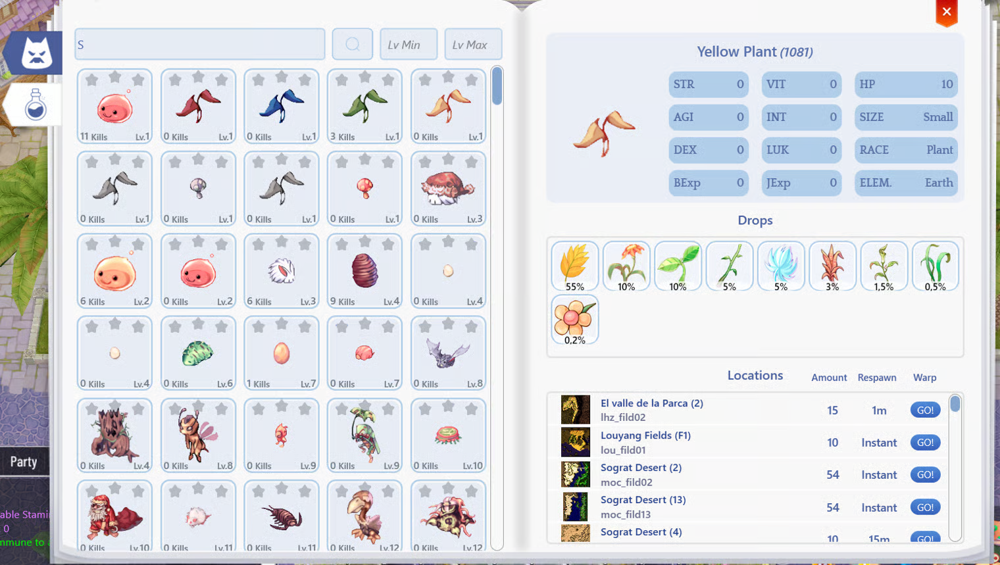

# 🦁 Bestiary

Displays basic information about monsters and their drops by pressing (ALT+B).

<figure><figcaption></figcaption></figure>

#### Monster Rank 

* By eliminating monsters, you now receive STAR bonuses based on the number eliminated.

**Normal Monster**

| Kills  | Bonus Damage |
| ------ | ------------ |
| 100    | 5%           |
| 1.000  | 10%          |
| 10.000 | 15%          |

**MVP Monsters (Boss)**

| Kills | Bonus Damage |
| ----- | ------------ |
| 25    | +5%          |
| 250   | +10%         |
| 1.000 | 15%          |
