# ⚛️ Gem System



* **All Gems have been updated** <mark style="color:red;">(</mark><mark style="color:red;">**27/02/25**</mark><mark style="color:red;">)</mark>.
* **New Gem Locations:** <mark style="color:purple;">(</mark><mark style="color:purple;">**Eldoria, Abyss Lake**</mark><mark style="color:purple;">).</mark>



## Lista: 27/02/25

* **Detardeurus Gem** _(MVP)_
* **Vesper Gem** _(MVP)_
* **Motaro Gem** _(MVP)_
* **Ainz Ooal Gem** _(MVP)_
* **Atroce Gem** _(MVP)_
* **Momón Gem** _(Mini Boss)_
* **Hydrobalancer Gem** _(Mini Boss)_
* **Ferus Scarlet Gem**
* **Ferus Green Gem**
* **Ancient Mimic Gem**
* **Dragon Egg Gem**
* **Blue Acidus Gem**
* **Golden Acidus Gem**
* **Dark Elf Gem**
* **Elf Shaman Gem**
* **Elfkid Gem**
* **Mechatree Gem**
* **Chôco Gem**
* **Giant Drone Gem**



* This is the **complete list** of all Gems up to the present moment in _"Arkaik: Tales of Sarina"_.
* You can **"**<mark style="color:red;">**Navigate**</mark>**"** through the tabs below to find what you need, **example GIF below**.

<figure><figcaption></figcaption></figure>



## **Characteristics**

* **The stronger the monster, the harder it is to obtain its gem.** The chance of obtaining a monster's gem can range from <mark style="color:red;">**0.01% to 100%**</mark><mark style="color:red;">.</mark>
* **Gems do not stack their effects.** For example, if you have a dagger with a **Poring Gem** and boots with another **Poring Gem**, the effect is **applied only once**.
* **While equipped with a monster gem**, if you engage in combat with that same monster, you receive **-10% damage taken and +5% damage dealt** to it. Additionally, **you heal 1% of your HP/SP when defeating it**.
* **Unlike Cards, Gems can be attached to any equipment** that has an **available gem slot**, regardless of type.
* **Gems can be removed** using the skill **"**<mark style="color:red;">**Never Had Luck**</mark>**"**.

## **Types of Gems**

* There are currently **3 types of Gems** on the server.

<table><thead><tr><th width="110">Image</th><th>Description</th></tr></thead><tbody><tr><td></td><td>MVP Gems are <mark style="color:yellow;">gold-colored</mark>.</td></tr><tr><td></td><td>Mini-Boss Gems are <mark style="color:blue;">blue-colored</mark>.</td></tr><tr><td></td><td>Common Gems are <mark style="color:purple;">purple-colored</mark>.</td></tr></tbody></table>

## **Attaching a Gem**

* **Left-click** on the gem in your inventory.
* The following screen will appear.

<figure>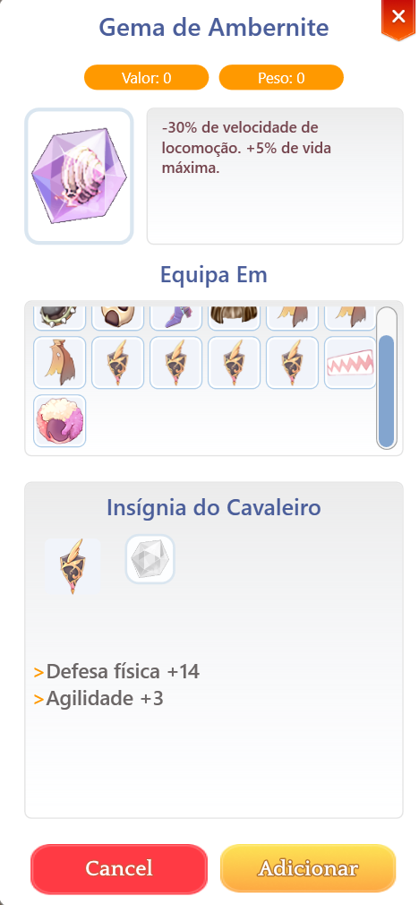<figcaption>
<mark style="color:red;"><strong>Right-Clicking to Inspect the Gem</strong></mark>
</figcaption></figure>

## **How to Attach a Gem**

1. **Click on an item**, then press the **"**<mark style="color:red;">**Add**</mark>**"** button.
2. A <mark style="color:red;">**confirmation message**</mark> will appear in your chat.
3. **Left-click on the item** to check the attached gem.

<figure>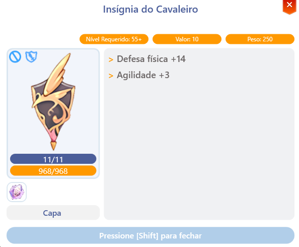<figcaption>
<mark style="color:red;"><strong>Gem Linked to the Equipment</strong></mark>
</figcaption></figure>



## Atrributes

| Monster                 | Effect                                          |
| ----------------------- | ----------------------------------------------- |
| Orc Skeleton Gem        | Max HP -500. STR +5.                            |
| Orc Zombie Gem          | Max HP -700. STR +5.                            |
| Rybio Gem               | If the user has **99 or more DEX**: **STR +5**. |
| Flying Exterminator Gem | +STR +2                                         |
| Orc Warrior Gem         | STR +2                                          |
| Minorous Gem            | STR +3                                          |
| Deniro Gem              | SSTR +2                                         |

## **Attack Gems**

| Monster       | Effect           |
| ------------- | ---------------- |
| Crab Gem      | ATK +2.          |
| Porcellio Gem | ATK +10.         |
| Skeleton Gem  | ATK +4.          |
| Matyr Gem     | +3 basic attack. |

## **Close-Range Damage**

| Monster      | Effect                                          |
| ------------ | ----------------------------------------------- |
| Dullahan Gem | Increases **close-range attack damage by +5%**. |



## Attributes

| Monster       | Effect  |
| ------------- | ------- |
| Laundress Gem | AGI +2. |
| Kukre Gem     | AGI +1. |
| Wild Rose Gem | AGI +2. |
| Swordfish Gem | AGI +3. |

## **Attack Speed**

| Monster             | Effect                            |
| ------------------- | --------------------------------- |
| Worker Skeleton Gem | VidMax HP -500. +2% attack speed. |
| Dark Nightmare Gem  | +2% attack speed.                 |
| Chimera Gem         | **+3 attack speed**.              |

## **Movement Speed**

| Monster    | Effect                   |
| ---------- | ------------------------ |
| Rabbit Gem | **+10% movement speed**. |
| Alarm Gem  | **+10% movement speed**. |
| Clock Gem  | **+10% movement speed**. |
| Harpy Gem  | **+5% movement speed**.  |
| Breeze Gem | **+10% movement speed**. |
| Drone Gem  | **+5% movement speed**.  |
| Yoyo Gem   | **+10% movement speed**. |
| Verit Gem  | **+3% movement speed**.  |
| Wolf Gem   | **+10% movement speed**. |

## **Perfect Dodge and Dodge**

| Monster       | Effect                                          |
| ------------- | ----------------------------------------------- |
| Mist Gem      | Immunity to map toxicity. **Perfect Dodge +1**. |
| Argiope Gem   | **Perfect Dodge +2%**.                          |
| Zenorc Gem    | **Dodge +3**.                                   |
| Anopheles Gem | **Dodge +2%**.                                  |
| Banshee Gem   | **Perfect Dodge +2**.                           |
| Whisper Gem   | **Dodge +5**.                                   |
| Dust Gem      | **Dodge +2%**.                                  |
| Orc Baby Gem  | **Dodge +4**.                                   |
| Jack Gem      | **Dodge +1**.                                   |
| Hode Gem      | **Dodge +4**.                                   |
| Thief Bug Gem | **Dodge +2**.                                   |
| Chôco Gem     | **Perfect Dodge +5. CRIT +5**.                  |



## Attributes

| Monster           | Effect                                                     |
| ----------------- | ---------------------------------------------------------- |
| Marine Sphere Gem | If base level is **60 or higher**, grants **+3 Vitality**. |
| Battering Gem     | Defense based on **Vitality +6**.                          |
| Lava Golem Gem    | **+5 Vitality**.                                           |
| Evil Druid Gem    | +**+4% Max HP**.                                           |
| Nine-Tails Gem    | Gains **+1 Vitality per 10 levels**.                       |
| Requiem Gem       | **+1 Vitality**.                                           |
| Picky Gem         | **+1 Vitality**.                                           |
| Piere Gem         | **+3 Vitality**.                                           |
| Poring Gem        | **+1 Vitality**.                                           |

## Life (HP Boosting Gems)

| Monster         | Effect                                             |
| --------------- | -------------------------------------------------- |
| Apocalypse Gem  | **+1000 Max HP**.                                  |
| Mars Gem        | **+470 Max HP**.                                   |
| Soldier Gem     | Stops **natural HP regeneration**. **+3% Max HP**. |
| Martin Gem      | **+200 Max HP**.                                   |
| Majoruros Gem   | **+700 Max HP**.                                   |
| Fabre Gem       | **+10 Max HP**.                                    |
| Ambernite Gem   | **-30% movement speed**, **+5% Max HP**.           |
| Marionette Gem  | **-5 Agility**, **+300 Max HP**.                   |
| Ant Egg Gem     | **+50 Max HP**.                                    |
| Green Ferus Gem | **+380 Max HP, +2 Vitality, -100 Max SP**.         |

## **HP Recovery**

| Monster             | Effect                                                                                              |
| ------------------- | --------------------------------------------------------------------------------------------------- |
| Prisoner Zombie Gem | Recovers **300 HP every 5 seconds**. Unequipping an item with this gem **reduces user HP by 1000**. |
| Nereid Gem          | +10% natural HP recovery.                                                                           |
| Marin Gem           | +10% natural HP recovery.                                                                           |

## HP Recovery by Attacks

| Monster     | Effect                                                                   |
| ----------- | ------------------------------------------------------------------------ |
| Obeaune Gem | Recovers **50 HP** when landing basic attacks on **fish-type monsters**. |
| Strouf Gem  | Recovers **50 SP** when landing basic attacks on **fish-type monsters**. |

## **Physical Defense**

| Monster        | Effect                             |
| -------------- | ---------------------------------- |
| Encouraged Gem | **+3% Vital Defense**.             |
| Raydric Gem    | **+4% Physical Defense**.          |
| Cornutus Gem   | **DEF +2**.                        |
| Mineral Gem    | **+7% Defense based on Vitality**. |
| Munak Gem      | **DEF +3**.                        |
| Golem Gem      | **DEF +6**.                        |
| Andre Gem      | **DEF +2**.                        |
| Skeleton Gem   | **Reduces DEF by 2%**.             |

## Damage Reduction (Physical & Magical)

| Monster           | Effect                                                                  |
| ----------------- | ----------------------------------------------------------------------- |
| Archdam Gem       | RedReduces **physical damage received by 3%**.                          |
| Cursed Frame Gem  | **+5% defense against magical attacks**.                                |
| Owl Baron Gem     | Reduces **magical damage received by 3%**.                              |
| Hornet Beetle Gem | **+3% resistance to ranged attacks**.                                   |
| Zombie Gem        | Stops **natural HP recovery**. **Reduces melee damage taken by 2%**.    |
| Ghoul Gem         | IStops **natural SP recovery**. **Reduces melee damage taken by 2%**.   |
| Mechatree Gem     | **Reduces damage received from large monsters by 7%**. **+170 Max HP**. |

## **Magical Defense**

| Monster                                                                   | Effect                   |
| ------------------------------------------------------------------------- | ------------------------ |
| Obsidian Gem                                                              | **+7% magical defense**. |
| [G](https://arkaikonline.com/database/items?search=9954)Thief Bug Egg Gem | **MDEF +4**.             |

## Resistência Elemental e Efeitos

| Monster             | Effect                                                                              |
| ------------------- | ----------------------------------------------------------------------------------- |
| Freezer Gem         | **+5% resistance to freezing**.                                                     |
| Gaze Perceval Gem   | **Grants 4% resistance to Silence**.                                                |
| Tower Keeper Gem    | **5% resistance to freezing**.                                                      |
| Lava Labyrinth Gem  | **20% resistance to burning**.                                                      |
| Diabolic Gem        | **-5% damage received from the Shadow element**.                                    |
| Boom Gem            | -**5% damage received from the Fire element**.                                      |
| Thara Frog Gem      | **5% poison damage reduction**.                                                     |
| Stalactic Golem Gem | **+7% resistance to Stun**.                                                         |
| Caramelo Gem        | **+3% resistance to physical damage from the Earth element**.                       |
| Rockoso Gem         | **+10% resistance to Sleep**.                                                       |
| Marduk Gem          | +**4% resistance to Silence**.                                                      |
| Tormented Soul Gem  | **+3% resistance to Curse**.                                                        |
| Scorpion Gem        | **+2% resistance to Poison**.                                                       |
| Anaconda Gem        | **+2% resistance to Poison**.                                                       |
| Rattlesnake Gem     | **+2% resistance to Poison**.                                                       |
| Jibóia Gem          | **+2% resistance to Poison element damage**.                                        |
| Spore Gem           | **+1% resistance to Poison element damage**.                                        |
| Leib Olmai Gem      | **+20% resistance to \[Stun]**.                                                     |
| Green Maiden Gem    | **+1% Critical Resistance**. **+1% per equipment refinement level (Max +10)**.      |
| Mao Guai Gem        | **+20% resistance to Ghost property. -30 Flee**.                                    |
| Zhu Po Long Gem     | **+3% resistance to all elements**.                                                 |
| Mi Gao Gem          | **-5% damage taken from ranged (physical/magical) attacks during War of Emperium**. |
| Giant Drone Gem     | **-5% damage received from Wind**.                                                  |

## **Healing Bonus**

| Monster            | Effect                                                                                   |
| ------------------ | ---------------------------------------------------------------------------------------- |
| Worm Tail Gem      | **Increases healing received from active skills by 7%**.                                 |
| Pingu Gem          | **Increases healing effectiveness of all active skills on you by 10%**. **-5 Vitality**. |
| Bigfoot Gem        | **Increases HP healing effectiveness of Honey item by 300%**.                            |
| Steel Chonchon Gem | A**Increases effectiveness of all heals by 1%**.                                         |
| Peco Peco Egg Gem  | **Increases healing effectiveness from skills by 2%**.                                   |
| Thief Bug Egg Gem  | **Increases healing effectiveness from skills by 1%**.                                   |
| Cramp Gem          | A**Increases the efficiency of healing items by 5%**.                                    |

## **Defense and Equipment Effects**

| Monster              | Effect                                                                                                         |
| -------------------- | -------------------------------------------------------------------------------------------------------------- |
| Wootan Fighter Gem   | **Reflects 1% of ranged physical damage received**.                                                            |
| Leaf Cat Gem         | **Reduces weapon break chance by 7%**.                                                                         |
| Starfish Gem         | **-40% Max HP. User is immune to knockback**.                                                                  |
| Creamy Gem           | **Reflects 1% of long-range damage**.                                                                          |
| Savage Gem           | **Reduces weapon break chance by 2%**.                                                                         |
| Anubis Gem           | **Weapon cannot be removed by skills. Reduces Max HP by 10%**.                                                 |
| Sea Horse Gem        | T**Makes shoes indestructible**.                                                                               |
| Poporing Gem         | **Reduces equipment break chance by 1%**.                                                                      |
| Mimic Gem            | **Reduces reflected damage by 1%**.                                                                            |
| Arclouse Gem         | **0.1% chance to reduce the target's HP by 1% with basic attacks (applies up to 5 times on the same target)**. |
| Tarou Gem            | **1% chance to cast Increase Agility Lv.1 when hit by physical attacks**.                                      |
| Female Thief Bug Gem | **1% chance to cast Increase Agility Lv.1 when hit by physical attacks**.                                      |
| Jing Guzi Gem        | **When dealing physical attacks, 40% chance to remove \[Chaos] from the attacker**.                            |

## **Mixed Defense**

| Monster       | Effect                           |
| ------------- | -------------------------------- |
| Metalling Gem | +3 physical and magical defense. |

## **HP Effects**

| Monster             | Effect                                                                                                                     |
| ------------------- | -------------------------------------------------------------------------------------------------------------------------- |
| Plague Gem          | **0.1% chance to subtract 2% of the target's max HP when using basic attacks (applies up to 5 times on the same target)**. |
| Hunter Fly Gem      | **0.5% chance to convert 7% of physical damage dealt into HP**.                                                            |
| Familiar Gem        | **Recovers 3 HP when executing a normal attack**.                                                                          |
| Desert Wolf Pup Gem | **Recovers 30 HP when killing a target with a melee attack**.                                                              |
| Scarlet Ferus Gem   | **When defeating monsters with any magical attack, restores 100 HP. Max SP -100**.                                         |



## Attributes

| Monster	          | Effect      |
| ----------------- | ----------- |
| Ancient Gem       | **+3 INT**. |
| Wise Worm Gem     | **+3 INT**. |
| Ancient Mummy Gem | **+3 INT**. |
| Vitata Gem        | **+3 INT**. |

## **Magic Attack**

| Monster	       | Effect                                                                                |
| -------------- | ------------------------------------------------------------------------------------- |
| Isis Gem       | **+3 Magic Attack**.                                                                  |
| Dark Elf Gem   | A**MATK +30. Casting cannot be interrupted**.                                         |
| Elf Shaman Gem | **MATK +30. When using a two-handed staff: +10% resistance to the Neutral property**. |

## SP (Max SP Boost)

| Monster	         | Effect                                         |
| ---------------- | ---------------------------------------------- |
| Medusa Gem       | **+290 Max SP**.                               |
| Sohee Gem        | **+4% Max SP**.                                |
| Rodda Frog Gem   | **+10 Max SP**.                                |
| Golden Novus Gem | **+250 Max SP. +10% natural SP regeneration**. |

## **SP Recovery**

| Monster	   | Effect                                     |
| ---------- | ------------------------------------------ |
| Marina Gem | **Restores 1% of max SP every 5 seconds**. |

## **Magic Attack & SP Effects**

| Monster	          | Effect                                                                             |
| ----------------- | ---------------------------------------------------------------------------------- |
| Anolian Gem       | **Drains 3 SP from the target with each basic attack**.                            |
| Mummy Gem         | **Restores 7 HP when killing monsters with magic attacks**.                        |
| Drainliar Gem     | **Recovers 2 SP when attacking**.                                                  |
| Ancient Mimic Gem | **When defeating monsters with any physical attack, restores 10 SP. Max HP -100**. |

## **Mixed Effects**

| Monster	        | Effect                                |
| --------------- | ------------------------------------- |
| Blue Acidus Gem | **+180 Max SP. +2 INT. -100 Max HP**. |



## Attribute

| Monster             | Effect                                                                        |
| ------------------- | ----------------------------------------------------------------------------- |
| Mineros Gem         | **+2 Dexterity**.                                                             |
| Forest Guardian Gem | **If used by Archers: +4 Dexterity**.                                         |
| Rocker Gem          | **+1 Dexterity. If used by Bard or Odalisques, grants +5 Dexterity instead**. |
| Zerom Gem           | **+1 Dexterity**.                                                             |

## Casting

| Monster     | Effect                                                            |
| ----------- | ----------------------------------------------------------------- |
| Fen Gem     | **-3% Cast Time**.                                                |
| Bathory Gem | **Reduces variable cast time of all skills by 300ms. -10% Mana**. |

## **Effects Against Dodge**

| Monster    | Effect                                        |
| ---------- | --------------------------------------------- |
| Hornet Gem | **Ignores 5% of the target's perfect dodge**. |

## **Hit & Accuracy Bonus**

| Monster                 | Effect                                  |
| ----------------------- | --------------------------------------- |
| Prisoner Skeleton Gem   | **-7% Movement Speed. +5% Hit Chance**. |
| Ground Exterminator Gem | **+2% Hit Rate Chance**.                |
| Coco Gem                | **+4% Hit Chance**.                     |
| Yao Jun Gem             | **+30 Hit**.                            |
| Tin Soldier Gem         | **+15 Hit. +10 Perfect Hit**.           |
| Elfkid Gem              | **+15 Perfect Hit. -15 Critical**.      |

## **Ranged Damage**

| Monster             | Effect                                     |
| ------------------- | ------------------------------------------ |
| Raydric Archer Gem  | **+4% damage with ranged attacks**.        |
| Archer Skeleton Gem | **+2% physical ranged damage**.            |
| Goblin Archer Gem   | **+3% damage from ranged attacks**.        |
| Kobold Archer Gem   | **+2% damage from ranged attacks**.        |
| Stone Shooter Gem   | **Grants +(Dexterity/10)% ranged damage**. |



## **Attributes**

| Monster          | Effect                                          |
| ---------------- | ----------------------------------------------- |
| Mastering Gem    | **If Luck is greater than 40, grants +3 Luck**. |
| Raggler Gem      | **+1 Luck**.                                    |
| Holden Gem       | **+2 Luck**.                                    |
| Poison Spore Gem | **Immunity to toxic air. +1 Luck**.             |
| Plankton Gem     | **-2 Strength / +2 Luck**.                      |
| Lunatic Gem      | **+1 Luck**.                                    |
| Condor Gem       | **+1 Luck**.                                    |

## Critical

| Monster              | Effect                                             |
| -------------------- | -------------------------------------------------- |
| Punk Gem             | **+2 Critical**.                                   |
| Orc Archer Gem       | **+5 Critical when using ranged basic attacks**.   |
| Soldier Skeleton Gem | **+2 Critical Rate**.                              |
| Steam Goblin Gem     | **Inflicts 3% more damage with Critical Attacks**. |
| Desert Wolf Gem      | **+2% Critical**.                                  |



## Elemental Damage

| Monster            | Effect                                                                 |
| ------------------ | ---------------------------------------------------------------------- |
| Wood Golem Gem     | **Increases Physical & Magical Damage using the Earth element by 7%**. |
| Cursed Tree Gem    | **Increases Physical & Magical Damage using the Earth element by 4%**. |
| Loli Ruri Gem      | **Increases Physical & Magical Damage using the Water element by 7%**. |
| Lude Gem           | **Increases Ghost property magical damage by 20%**.                    |
| Poltergeist Gem    | **Increases Ghost property magical damage by 20%**.                    |
| Dimik Gem          | **+4% Physical Damage against Neutral property enemies**.              |
| Dimik (Wind) Gem   | **+4% Physical Damage against Wind property enemies**.                 |
| Dimik (Water) Gem  | **+4% Physical Damage against Water property enemies**.                |
| Dimik (Earth) Gem  | **+4% Physical Damage against Earth property enemies**.                |
| Dimik (Fire) Gem   | **+4% Physical Damage against Fire property enemies**.                 |
| Venatu Gem         | **+4% Magical Damage against Neutral property enemies**.               |
| Venatu (Fire) Gem  | **+4% Magical Damage against Fire property enemies**.                  |
| Venatu (Wind) Gem  | **+4% Magical Damage against Wind property enemies**.                  |
| Venatu (Earth) Gem | **+4% Magical Damage against Earth property enemies**.                 |
| Venatu (Water) Gem | +**+4% Magical Damage against Water property enemies**.                |
| Vadon Gem          | **+5% Physical Damage against Fire property**.                         |
| Kaho Gem           | **+4% Physical & Magical Damage against Earth property**.              |
| Rideword Gem       | +**+3% Damage to all elements except Shadow**.                         |
| Triton Gem         | **+7% Physical & Magical Damage against Fire property**.               |
| Mollusk Gem        | **+4% Physical & Magical Damage against Water property**.              |
| Wind Shaman Gem    | **Increases skill damage of Wind element by 3%**.                      |
| Nightmare Gem      | **Increases skill damage of Fire element by 3%**.                      |
| Ancient Willow Gem | **+4% Physical & Magical Damage against Fire property**.               |
| Willow Gem         | **+4% Physical & Magical Damage against Earth property**.              |

## Skills

| Monster               | Effect                                                                                    |
| --------------------- | ----------------------------------------------------------------------------------------- |
| Masquerade Gem        | **Reduces cooldown time of \[Stealth] by 1 second**.                                      |
| Serial Killer Gem     | **When casting \[Destroyer Blades], has a 3% chance to auto-cast \[Fatal Blow]**.         |
| Quve Gem              | **Increases success rate of \[Steal] by 0.02%**.                                          |
| Teddy Bear Gem        | **Reduces damage received from \[Destroyer Blades] by 10%**.                              |
| Aggressor Gem         | **Increases damage of \[Magnus Exorcismus] by 10%**.                                      |
| Heater Gem            | **Reduces cooldown of \[Fire Lance] by 0.2 seconds**.                                     |
| Wootan Shooter Gem    | **Reduces cooldown of \[Thor’s Wrath] by 2 seconds**.                                     |
| Jirtas Gem            | **+4% damage with \[Piercing Stab] and \[Melodic Arrow]**.                                |
| Wanderer Gem          | **Enables use of \[Recover] at level 7**.                                                 |
| Wronged Gem           | **+15% damage with \[Destroyer Blades]**.                                                 |
| Carrot Gem            | **Enables use of \[Provoke] at level 8**.                                                 |
| Alice Gem             | **+10% damage with \[Fatal Blow]**.                                                       |
| Arenoso Gem           | **Adds a 0.1% chance to auto-cast \[Arcane Protection] when receiving physical attacks**. |
| Crocodile Gem         | **+4% damage with \[Stone Column]**.                                                      |
| Seal Gem              | **Reduces damage received from \[Water Balls] by 10%**.                                   |
| Otter Gem             | **Reduces damage received from \[Blizzard] by 7%**.                                       |
| Carnivorous Plant Gem | **Enables use of \[Steal HP] at level 3**.                                                |
| Grove Gem             | **Reduces SP cost of \[Recover] by 40%**.                                                 |
| Scarlet Novus Gem     | **Small chance to inflict \[Chaos] on the target when landing physical attacks**.         |
| Dokebi Gem            | **Reduces damage received from \[Fire Lance] by 5%**.                                     |
| Wild Baby Gem         | **Adds 0.1% chance to inflict Stun on the target with each attack**.                      |
| Smokey Gem            | **-50% Max HP. Allows the user to see invisible opponents**.                              |
| Kobold Gem            | **Reduces damage received from \[Arrow Storm] by 5%**.                                    |
| Kobold Gem            | **Reduces damage received from \[Arrow Storm] by 3%**.                                    |
| Grand Orc Gem         | **Enables use of \[Endure] at level 1**.                                                  |
| Orc Lady Gem          | **Adds a 0.01% chance to inflict Bleeding on the target with any attack**.                |
| Pasana Gem            | **+4% damage with \[Destroyer Blades]**.                                                  |
| Muka Gem              | **Reduces damage received from \[Fire Lance] by 5%**.                                     |
| Frilldora Gem         | 0**0.1% chance to auto-cast \[Stealth] level 10 when hit**.                               |
| Horong Gem            | **Enables use of \[Supernova] at level 1**.                                               |

## **Size-Based Damage**

| Monster           | Effect                                                           |
| ----------------- | ---------------------------------------------------------------- |
| Old Furnace Gem   | **+10% magical damage against small-sized monsters**.            |
| Dryad Gem         | **+5% magical damage against small-sized monsters**.             |
| Flora Gem         | **+2% physical damage against small-sized monsters**.            |
| Golden Acidus Gem | **+7% physical & magical damage against large-sized opponents**. |

## Races & Elemental Effects

| Monster            | Effect                                                                        |
| ------------------ | ----------------------------------------------------------------------------- |
| Ungoliant Gem      | **+20% attack against Insect and Plant race monsters**.                       |
| Toxic Cloud Gem    | **Immunity to map toxicity. +6% damage against Poison property targets**.     |
| Venomous Cloud Gem | **Immunity to map toxicity. +6% damage against Poison property targets**.     |
| Rafflesia Gem      | **Reduces damage taken from Fish race monsters by 5%**.                       |
| Grand Peco Gem     | **+50% physical & magical damage against Peco Peco monsters**.                |
| Parasite Gem       | **0.1% chance to cause Bleeding on Brute race monsters when attacking**.      |
| Argos Gem          | **+5% damage against Insect race monsters**.                                  |
| Baphomet Jr. Gem   | **+50% physical damage & +25% magical damage against Baphomet epic monster**. |
| Penomena Gem       | **+3% damage against Humanoid monsters and Players**.                         |
| Fendark Gem        | **+4% damage against Humanoid monsters and Players**.                         |
| Sting Gem          | **+7% experience received from Amorphous race monsters**.                     |
| Abyss Knight Gem   | **+4% physical & magical damage against Boss monsters**.                      |
| Megalith Gem       | **+20% physical & magical defense against Tao Gunka monster**.                |
| Goat Gem           | **+40% damage against Goat monster**.                                         |
| Pungus Gem         | **Ignores 5% of Demon race defense**.                                         |
| Driller Gem        | **+5% physical & magical damage against Brute race monsters**.                |
| Bongun Gem         | **Receives 200% less damage from Munak**.                                     |
| Hydra Gem          | **+5% Physical Damage against Humanoid monsters and Players**.                |
| Goblin Gem         | **+1% Physical Damage against Humanoid monsters and Players**.                |
| Goblin Gem         | **+2% Physical Damage against Humanoid monsters and Players**.                |
| Goblin Gem         | **+3% Physical Damage against Humanoid monsters and Players**.                |
| Goblin Gem         | **+4% Physical Damage against Humanoid monsters and Players**.                |
| Goblin Gem         | **+5% Physical Damage against Humanoid monsters and Players**.                |
| Mantis Gem         | **Ignores 10% of the defense of Insect race monsters**.                       |
| Giearth Gem        | **Ignores 3% of the defense of Insect race monsters**.                        |

## **XP Bonus & Zeny Drop**

| Monster             | Effect                                                                    |
| ------------------- | ------------------------------------------------------------------------- |
| Devicee Gem         | **+30% experience from Plant race monsters**.                             |
| Pirate Skeleton Gem | **1% chance to obtain up to 500 Zeny when defeating monsters**.           |
| Owl Duke Gem        | **+30% experience received when killing monsters in Glast Heim**.         |
| Petite Gem          | **+5% experience when killing Dragon race monsters**.                     |
| Mandragora Gem      | **Increases experience received when killing Plant race monsters by 7%**. |
| Deviling Gem        | **3% chance to obtain up to 500 Zeny when defeating monsters**.           |
| Drops Gem           | **+1% item drop rate**.                                                   |
| Dragon Egg Gem      | **+10% experience from Large-sized monsters, but reduces Max HP by 20%**. |

## **Weight Capacity**

| Monster      | Effect                               |
| ------------ | ------------------------------------ |
| Grizzly Gem  | **+1000 Maximum Weight Capacity**.   |
| Magnolia Gem | **+1000 Maximum Carrying Capacity**. |

## **All Attributes**

| Monster         | Effect                    |
| --------------- | ------------------------- |
| Khalitzburg Gem | **+1 to all attributes**. |

## **Mixed Attributes**

| Monster           | Effect                                                                         |
| ----------------- | ------------------------------------------------------------------------------ |
| Cursed Priest Gem | **+2 Intelligence, +1 Dexterity**.                                             |
| Peco Peco Gem     | **+2 Agility. If used by Swordsmen and their evolutions, grants +3 Vitality**. |



## MVPS

<table><thead><tr><th width="153">Gem</th><th width="280">Monster	</th><th>Effect</th></tr></thead><tbody><tr><td></td><td>Queen Bee Gem</td><td>+35 Physical &#x26; Magical Damage against Insect Race. Grants use of [Rescue Teleport] at level 1.</td></tr><tr><td></td><td>Amon Ra Gem</td><td>Spotting an enemy automatically casts [Decrease Agility] level 10. Has a 10-minute cooldown before it can affect the same target again.</td></tr><tr><td></td><td>Baphomet Gem</td><td>+35% Physical &#x26; Magical Damage against Demon Race. If used together with Baphomet Jr. Gem: ATK &#x26; MATK +15, Critical -5.</td></tr><tr><td></td><td>Golden Thief Bug Gem</td><td>90% chance to ignore the effect of [Golden Thief Bug Card] on the target.</td></tr><tr><td></td><td>Doppelganger Gem</td><td>Enables Block Level 3. 5% chance to reflect any single-target skill back to the caster.</td></tr><tr><td></td><td>Dracula Gem</td><td>-20% Max HP &#x26; +90% Fire Element damage taken. Changes your race to Undead.</td></tr><tr><td></td><td>Drake Gem</td><td>Enables Power Amplifier (Removing the gem disables the effect). Increases Magic Damage against Shadow property by +15%.</td></tr><tr><td></td><td>Eddga Gem</td><td>+70% Damage to Stunned Targets.</td></tr><tr><td></td><td>Pharaoh Gem</td><td>Positive buffs persist after death. +7% Magic Damage across all properties.</td></tr><tr><td></td><td>Lunar Flower Gem</td><td>Monsters cannot initiate attacks on you directly but will retaliate.</td></tr><tr><td></td><td>Freeoni Gem</td><td>+50 Perfect Hit.</td></tr><tr><td></td><td>General Tartaruga Gem</td><td>Reduces Critical Damage received by 30%. Adds 7% chance to dodge an incoming Critical Attack.</td></tr><tr><td></td><td>Kraken Gem</td><td>+12% Max HP. Changes your size to Large.</td></tr><tr><td></td><td>Lady Tanee Gem</td><td>+5 Vitality. HP recovery items also restore SP in equal amounts. If unequipped, SP decay is set to 1 per second.</td></tr><tr><td></td><td>Maya Gem</td><td>Reduces single-target Magic Damage received by 10%.</td></tr><tr><td>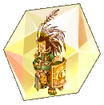</td><td>Orc Hero Gem</td><td>If your Strength is higher than your target’s, deal +15% Damage.</td></tr><tr><td></td><td>Osiris Gem</td><td>+3 to All Stats. Increases damage dealt by 10% to players with a different crest from yours. Deals extra damage to Protectors with the Courage crest.</td></tr><tr><td></td><td>Giant Octopus Gem</td><td>Increases Physical and Magic Damage by 35% when standing in a Water cell. (Works with [Deluge]).</td></tr><tr><td></td><td>RSX 0806 Gem</td><td>+10% Max HP. If used by a Protector with the Hope crest: Equipment cannot be broken or removed by skills while targeting an enemy.</td></tr><tr><td></td><td>Lord of the Dead Gem</td><td>Deals +30% Damage to Undead race. Has a 5% chance to completely ignore received damage when HP is below 15%.</td></tr><tr><td>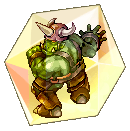</td><td>Orc Lord Gem</td><td>+3 Strength. If used by a Protector with the Friendship crest: Grants immunity to Freeze.</td></tr><tr><td></td><td>Tao Gunka Gem</td><td>+50 DEF and +25 MDEF. If the user also has a Tao Gunka card, the received damage is doubled.</td></tr><tr><td>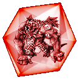</td><td>Morroc Emperor Gem</td><td>No information is available about this type of gem. It is extremely rare.</td></tr><tr><td>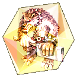</td><td>Atroce Gem</td><td>+35% Physical and Magical Damage against Brute race. Set Bonus with Wolf Gem: ATK &#x26; MATK +15, AGI -5.</td></tr><tr><td>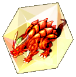</td><td>Detardeurus Gem</td><td>+35% Physical and Magical Damage against Dragon race. Set Bonus with Hydrolancer Gem: ATK &#x26; MATK +15, STR -5.</td></tr><tr><td></td><td>Vesper Gem</td><td>+35% Physical and Magical Damage against Formless race. Set Bonus with Apocalypse Gem: ATK &#x26; MATK +15, Max HP -500.</td></tr><tr><td></td><td>Motaro Gem</td><td>Max HP +3000, Max SP -15%.</td></tr><tr><td></td><td>Ainz Ooal Gown Gem</td><td>Ignores 70% of the DEF of normal monsters and players.</td></tr></tbody></table>

## MINI-BOSS

<table><thead><tr><th width="158">Gem</th><th width="284">Monster</th><th>Effect</th></tr></thead><tbody><tr><td></td><td>Dragonfly Gem</td><td>Perfect Dodge +10.</td></tr><tr><td></td><td>Wandering Wolf Gem</td><td>STR +10.</td></tr><tr><td></td><td>Eclipse Gem</td><td>VIT +10.</td></tr><tr><td>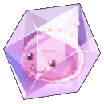</td><td>Mastering Gem</td><td>LUK +3. Increases drop rate by +6%.</td></tr><tr><td></td><td>Angeling Gem</td><td>Unlocks Resurrection Lv.1. Increases Physical &#x26; Magical Damage against Holy property enemies by 10%.</td></tr><tr><td></td><td>Ghostring Gem</td><td>Increases Physical Damage against Shadow property enemies by +15%.</td></tr><tr><td>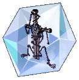</td><td>Mysteltainn Gem</td><td>Increases Physical Damage against Small-sized enemies by +12%..</td></tr><tr><td></td><td>Tirfing Gem</td><td>Increases Physical Damage against Medium-sized enemies by +12%.</td></tr><tr><td></td><td>Executor Gem</td><td>Increases Physical Damage against Large-sized enemies by +12%.</td></tr><tr><td></td><td>Griffon Gem</td><td>When performing physical attacks, 5% chance to auto-cast [Tyr's Impact] Lv. 5.</td></tr><tr><td></td><td>Mutant Dragon Gem</td><td>ATK +40.</td></tr><tr><td></td><td>Maya Macho Gem</td><td>Aproximar-se de um alvo Approaching an enemy will automatically cast [Stone Column] Lv. 1, revealing hidden or cloaked enemies.</td></tr><tr><td></td><td>Dark Illusion Gem</td><td>Variable cast time -30%. Max HP/SP +10%.</td></tr><tr><td></td><td>Nine-Tailed Cat Gem</td><td>INT +15</td></tr><tr><td></td><td>ArchAngeling Gem</td><td>Recovers 500 HP every 5 seconds. Grants +5% Max HP.</td></tr><tr><td>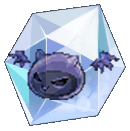</td><td>Deviling Gem</td><td>Resistance to all elements +10%.</td></tr><tr><td>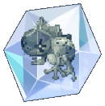</td><td>Sapo Cururu Gem</td><td>Perfect Dodge +10.</td></tr><tr><td></td><td>Hydrolancer Gem</td><td>Magic damage of Wind and Earth +8%. -4% damage received from Wind and Earth.</td></tr><tr><td></td><td>Momon Gem</td><td>Critical Damage +10%. Accuracy -150.</td></tr></tbody></table>


