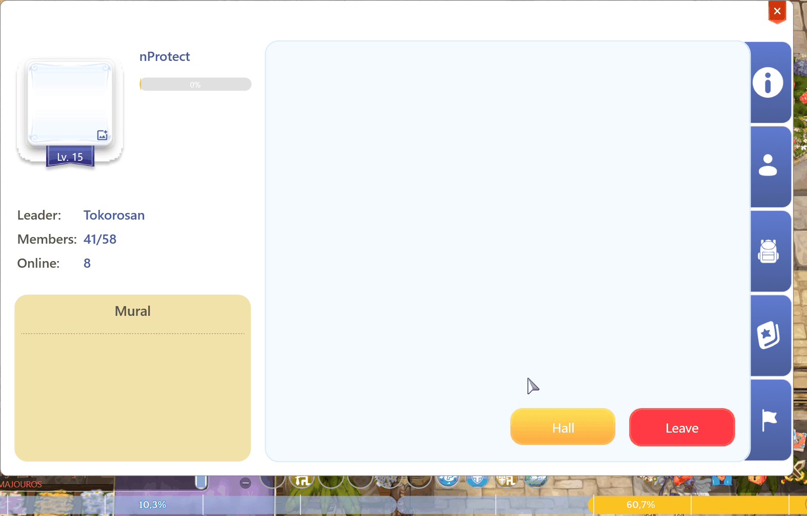
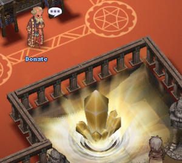
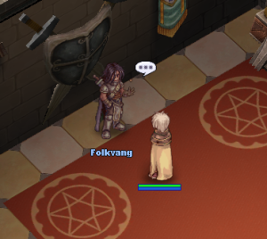
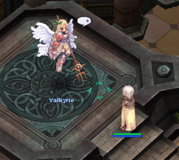

# 🏰 บ้านกิลด์

<figure><figcaption></figcaption></figure>

## เกี่ยวกับบ้านกิลด์

* <mark style="color:red;">**บ้านกิลด์**</mark> เป็นสถานที่ศูนย์กลางที่สมาชิกกิลด์สามารถมารวมตัวกัน สังคม และเสริมสร้างความสัมพันธ์ในฐานะชุมชน
* ด้านล่างนี้คือรายละเอียดที่ครอบคลุมเกี่ยวกับฟีเจอร์ที่สำคัญนี้

## วิธีเข้าถึงบ้านกิลด์

* คุณต้องเป็นส่วนหนึ่งของ <mark style="color:red;">**กิลด์**</mark> และจากนั้นกด <mark style="color:red;">**(ALT + G)**</mark>
* ในอินเทอร์เฟซกิลด์ คลิกที่ปุ่ม **"**<mark style="color:red;">**HALL**</mark>**"** เพื่อเทเลพอร์ตไปยังบ้านกิลด์ของคุณ

<figure><figcaption>
<mark style="color:red;"><strong>ใน ALT+G ของคุณ คลิกที่ "HALL" เพื่อเทเลพอร์ตไปยังบ้านกิลด์.</strong></mark>
</figcaption></figure>

## เกี่ยวกับ NPCs

* NPC แต่ละตัวภายใน **บ้านกิลด์** มีหน้าที่สำคัญ
* ขณะนี้มี <mark style="color:red;">**(3 NPC หลัก)**</mark>**&#x20;ภายในบ้านกิลด์** 
* สามารถปลดล็อก **NPC ใหม่** ภายใน <mark style="color:red;">**กิลด์**</mark> โดยการมีส่วนร่วมและทำภารกิจให้สำเร็จ

<table><thead><tr><th width="306">ภาพ</th><th>ข้อมูล</th></tr></thead><tbody><tr><td> <strong>บริจาค</strong></td><td>
ที่กลางแผนที่ <strong>บ้านกิลด์</strong> คุณจะพบ <strong>NPC บริจาคมาตรฐาน</strong> ซึ่งผู้เล่นสามารถบริจาคไอเทมต่างๆ ให้กับกิลด์ 

การ <strong>บริจาคไอเทมเป็นแบบสุ่ม</strong> หมายความว่าผู้เล่นสามารถบริจาคทรัพยากรที่หลากหลายเพื่อช่วยให้กิลด์เติบโตและพัฒนา
</td></tr></tbody></table>

<table><thead><tr><th width="308">ภาพ</th><th>ข้อมูล</th></tr></thead><tbody><tr><td><strong>Folkvang</strong></td><td>
<strong>Folkvang Boss Guild</strong> เป็น <strong>กิจกรรมกิลด์ประจำสัปดาห์</strong> ที่ผู้เล่นต้องเผชิญกับ <strong>บอส</strong> ที่มีระดับความยากแตกต่างกัน ตั้งแต่ระดับง่ายไปจนถึงระดับสุดขีด ขึ้นอยู่กับการเตรียมตัวของกิลด์ 

แต่ละกิลด์จะมี <strong>โอกาสหนึ่งครั้งต่อสัปดาห์</strong> ในการเอาชนะบอส หากพวกเขา <strong>ชนะ</strong> พวกเขา <strong>ไม่สามารถท้าทายบอสตัวอื่นได้</strong> แต่ถ้าล้มเหลว พวกเขาสามารถลองอีกครั้งในบอสตัวถัดไปที่มีให้ 

กิจกรรม <strong>พอร์ทัลจะเปิดอยู่เป็นเวลา 3 ชั่วโมง</strong> อนุญาตให้เข้าถึงได้ฟรี อย่างไรก็ตาม หากแผนที่ว่างเปล่าเกิน <strong>25 นาที</strong> พอร์ทัลจะปิด 

แต่ละ <strong>บอส</strong> มี <strong>กลไกเฉพาะ</strong> ที่จะถูกเปิดใช้งานเมื่อ <strong>HP ของมันลดลงถึง 70%, 50% และ 20%</strong>
</td></tr></tbody></table>

<table><thead><tr><th width="311">ภาพ</th><th>ข้อมูล</th></tr></thead><tbody><tr><td><strong>Valkyrie</strong></td><td>
 <strong>เหรียญการบริจาค</strong> ที่ได้รับจากการบริจาคสามารถใช้ที่ <strong>Valkyrie</strong> เพื่อเพิ่มสถิติของคุณ โดยให้ <strong>โบนัสถาวร</strong> สำหรับตัวละครของคุณ 

<strong>สมาชิกกิลด์</strong> สามารถรับ <strong>โบนัสพร</strong> และ <strong>โบนัสพรของ Valkyrie</strong> <strong>โบนัสพร</strong> จะถูกแลกเปลี่ยนเป็น <strong>เหรียญการบริจาค</strong> (ที่ได้รับจากการ <strong>บริจาค</strong> ให้กับ <strong>กิลด์</strong>) ในขณะที่ <strong>โบนัสพร</strong> จะถูกแลกเปลี่ยนเป็น <strong>การ์ดแอตทริบิวต์</strong> (ซึ่งสามารถได้รับจากการทำภารกิจ <strong>Guild Boss</strong>) 

โบนัสเหล่านี้เป็น <strong>เฉพาะตัวละครและถาวร</strong> หมายความว่าพวกเขาจะ <strong>ยังคงอยู่แม้ว่าผู้เล่นจะออกจากกิลด์</strong>
</td></tr></tbody></table>

## Buffs da Valkyrie Acumulados



## <mark style="color:red;">โบนัสพร</mark>

* ATK 0/100
* MATK 0/100
* MAX HP 0/100 (40 \~ 4000)
* DEF 0/100
* MDEF 0/100



## <mark style="color:red;">**โบนัสพร (การโจมตี)**</mark>

* ATK 0/30 - 30ATK
* MATK 0/30 - 30MATK
* ความเสียหายต่อมนุษย์ 0/30 (0.5% \~ 15%)
* ความเสียหายวิกฤต 0/30 (1% \~ 30%)
* มองข้ามการป้องกันเล็ก 0/30 (0.5% \~ 15%)
* มองข้ามการป้องกันกลาง 0/30 (0.5% \~ 15%)
* มองข้ามการป้องกันใหญ่ 0/30 (0.5% \~ 15%)
* มองข้าม MDEF. Non-Boss 0/30 (0.5% \~ 15%)
* มองข้าม MDEF. Boss 0/30 (0.5% \~ 15%)



## <mark style="color:red;">**โบนัสพร (การป้องกัน)**</mark>

* MAX HP 0/30 (100 \~ 3000)
* การลดความเสียหายธรรมชาติ 0/30 (0.5% \~ 15%)
* การลดความเสียหายเวท 0/30 (0.5% \~ 15%)
* การลดความเสียหายวิกฤต 0/30 (0.5% \~ 15%)
* การหลบหลีกวิกฤต 0/30 (0.5% \~ 15%)
* DEF 0/30 (0.5% \~ 15%)
* MDEF 0/30 (0.5% \~ 15%)
* มองข้าม MDEF. Non-Boss 0/30 (0.5% \~ 15%)
* มองข้าม MDEF. Boss 0/30 (0.5% \~ 15%)



## <mark style="color:red;">**โบนัสพร (ธาตุ)**</mark>

* ความเสียหายไฟ (0.5% \~ 15%)
* ความเสียหายดิน (0.5% \~ 15%)
* ความเสียหายลม (0.5% \~ 15%)
* ความเสียหายน้ำ (0.5% \~ 15%)
* การลดความเสียหายไฟ (0.5% \~ 15%)
* การลดความเสียหายดิน (0.5% \~ 15%)
* การลดความเสียหายลม (0.5% \~ 15%)
* การลดความเสียหายน้ำ (0.5% \~ 15%)
* มองข้าม MDEF. Boss (0.5% \~ 15%)



## <mark style="color:red;">**สถานะที่สะสม:**</mark>

* ATK 130
* MATK 130
* MAX HP 7000
* DEF 115
* MDEF 115
* มองข้าม MDEF. Non-Boss 30%
* มองข้าม MDEF. Boss 45%

