# 🛏️ Inn

<figure><figcaption></figcaption></figure>

## **Hệ Thống Nhà Trọ**

* Một số thành phố trong **Arkaik** có nhà trọ, và trong số đó, chúng sẽ cung cấp cho bạn một số buff nhất định.\
  Mỗi thành phố có **buff độc quyền** riêng.



<figure>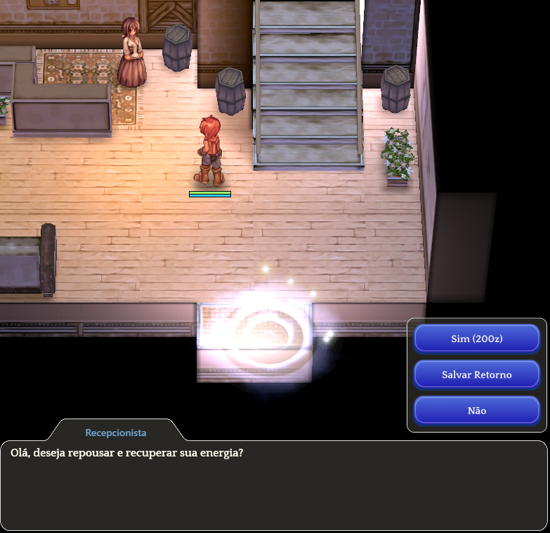<figcaption>
<mark style="color:red;">Nói chuyện với <strong>lễ tân</strong> tại địa điểm, và cô ấy sẽ tính cho bạn một <strong>phí bằng Zeny</strong>.</mark>
</figcaption></figure>



<figure>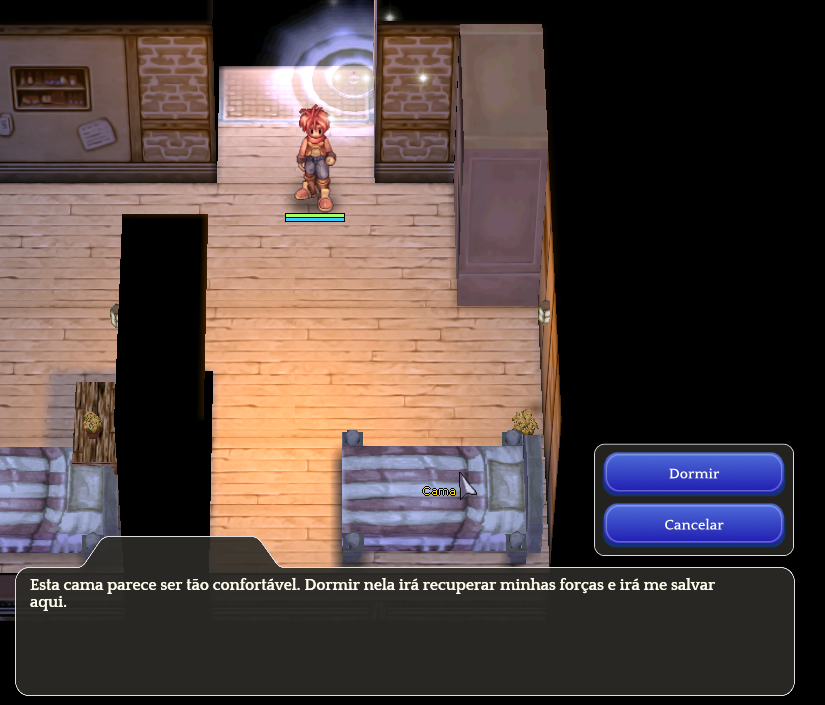<figcaption>
<mark style="color:red;">Sau đó, nhấp vào <strong>"Ngủ"</strong> để nhận buff của bạn và phục hồi <strong>HP/SP</strong>.</mark>
</figcaption></figure>



<table><thead><tr><th width="187">Thông tin</th><th>Mô tả</th></tr></thead><tbody><tr><td>Nhà trọ</td><td>Khi bạn đến một nhà trọ trong các thành phố, hãy đi vào qua cổng và nói chuyện với <strong>lễ tân</strong>.</td></tr><tr><td>Giá cả</td><td>
Phí nghỉ ngơi là <strong>400 Zeny</strong> cho người chơi thường.

<mark style="color:red;"><strong>Phí nghỉ ngơi chỉ là 200 Zeny cho người chơi VIP.</strong></mark>
</td></tr><tr><td>Giường</td><td>Bạn sẽ được dịch chuyển đến khu vực ngủ. Tương tác với giường để ngủ.</td></tr><tr><td>Buff</td><td>Khi ngủ, bạn sẽ nhận được các buff khác nhau tùy thuộc vào thành phố, vì mỗi thành phố có buff đặc biệt riêng.</td></tr><tr><td>Thời gian chờ</td><td><strong>5 giây</strong> hoạt ảnh cho người chơi thường, <mark style="color:red;"><strong>2 giây cho người chơi VIP</strong></mark>.</td></tr></tbody></table>

## Vị trí Nhà trọ| Zero (STR) | Mô tả | Bản đồ nhỏ |

\| ------------------------------- | -------------------------------------------------------------------------------------------------------------------------------------------------------------------------------------------------------------------------------------------------------------------------------------------------------------------------------------------------------------------------------------------------------------------------- | ------------------------------- || 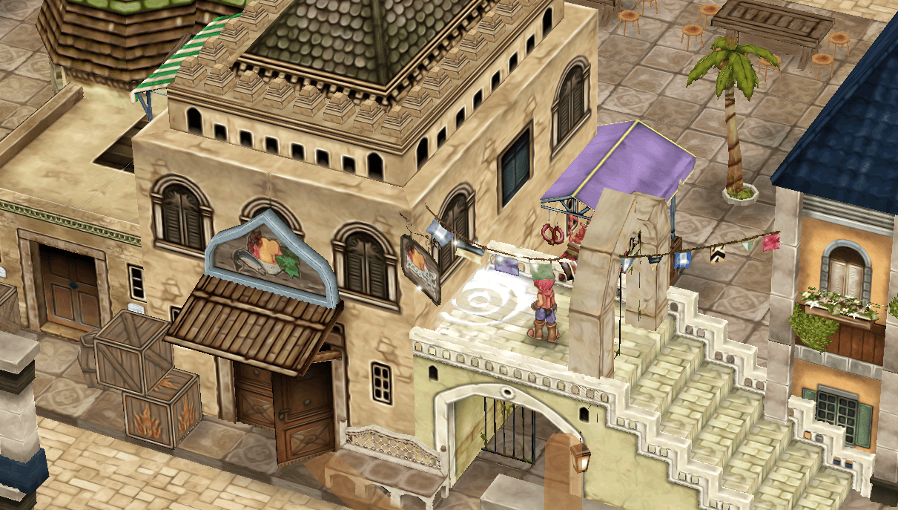 |

* **Thức ăn Tăng Cường Sức Mạnh:** +10
* **Khí Lực:** 10
* **Tập Trung:** 10
* **Magnificat:** 5
* **Gloria:** 5
* **Thời Gian Buff:** 15 phút (Thường)
* <mark style="color:red;">**Thời Gian Buff:**</mark> <mark style="color:red;"></mark><mark style="color:red;">30 phút (VIP)</mark>

\| !\[Mini-map of Zero - Capital of Rune-Midgard] | 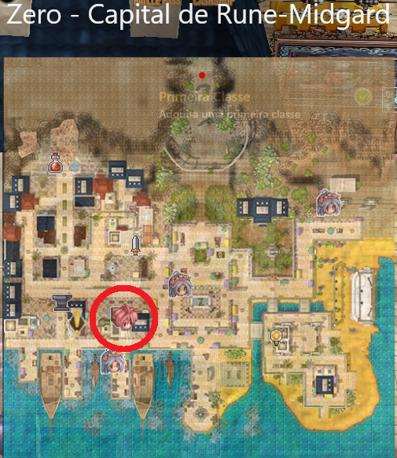 |

\| Payon (DEX) | Mô tả | Bản Đồ Nhỏ || ------------------------------- | -------------------------------------------------------------------------------------------------------------------------------------------------------------------------------------------------------------------------------------------------------------------------------------------------------------------------------------------------------------------------------------------------------------------- | ------------------------------- | | 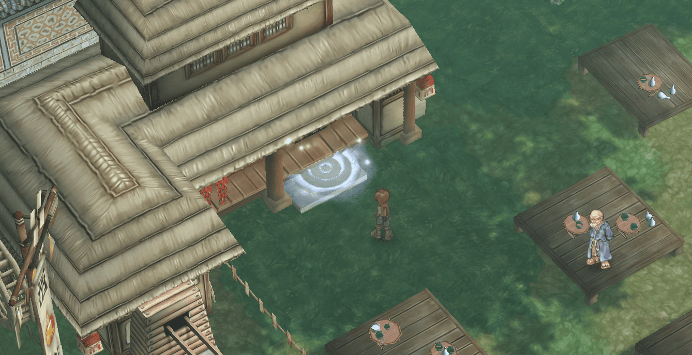 |

* **Thức ăn Tăng Dexterity:** +10
* **Sức mạnh:** 10
* **Tập trung:** 10
* **Magnificat:** 5
* **Gloria:** 5
* **Thời gian Buff:** 15 phút (Thường)
* <mark style="color:red;">**Thời gian Buff:**</mark> <mark style="color:red;"></mark><mark style="color:red;">30 phút (VIP)</mark>

\| !\[Mini-map of Payon - City of Archers] | 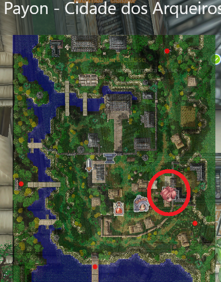 |

<table><thead><tr><th width="252">Geffen (INT)</th><th>Mô tả</th><th>Bản đồ nhỏ</th></tr></thead><tbody><tr><td></td><td><ul><li><strong>Thức ăn Trí tuệ:</strong> +10</li><li><strong>Sức mạnh:</strong> 10</li><li><strong>Tập trung:</strong> 10</li><li><strong>Magnificat:</strong> 5</li><li><strong>Gloria:</strong> 5</li><li><strong>Thời gian Buff:</strong> 15 phút (Bình thường)</li><li><mark style="color:red;"><strong>Thời gian Buff:</strong> 30 phút (VIP) | ![Bản đồ nhỏ của Geffen - Thành phố Ma thuật</mark>]</li></ul></td><td></td></tr></tbody></table>

<table><thead><tr><th width="250">Morroc (FLEE)</th><th>Mô tả</th><th>Bản đồ nhỏ</th></tr></thead><tbody><tr><td>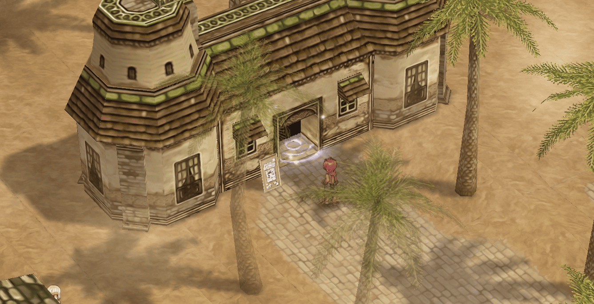</td><td><ul><li><strong>Thức ăn Flee:</strong> +15</li><li><strong>Sức mạnh:</strong> 10</li><li><strong>Tập trung:</strong> 10</li><li><strong>Magnificat:</strong> 5</li><li><strong>Gloria:</strong> 5</li><li><strong>Thời gian Buff:</strong> 15 phút (Bình thường)</li><li><mark style="color:red;"><strong>Thời gian Buff:</strong> 30 phút (VIP) | ![Bản đồ nhỏ của Morroc - Thành phố Thương mại]</mark></li></ul></td><td></td></tr></tbody></table>

<table><thead><tr><th width="245">Alberta (LUK)</th><th>Mô tả</th><th>Bản đồ nhỏ</th></tr></thead><tbody><tr><td></td><td><ul><li><strong>Thức ăn may mắn:</strong> +10</li><li><strong>Sức mạnh:</strong> 10</li><li><strong>Tập trung:</strong> 10</li><li><strong>Magnificat:</strong> 5</li><li><strong>Gloria:</strong> 5</li><li><strong>Thời gian buff:</strong> 15 phút (Bình thường)</li><li><mark style="color:red;"><strong>Thời gian buff:</strong> 30 phút (VIP) | ![Bản đồ nhỏ của Alberta - Thành phố cảng]</mark></li></ul></td><td></td></tr></tbody></table>

\| Aldebaran (VIT) | Mô tả | Bản đồ nhỏ | | -------------------------------- | ------------------------------------------------------------------------------------------------------------------------------------------------------------------------------------------------------------------------------------------------------------------------------------------------------------------------------------------------------------------------------------------------------------------ | ------------------------------- || 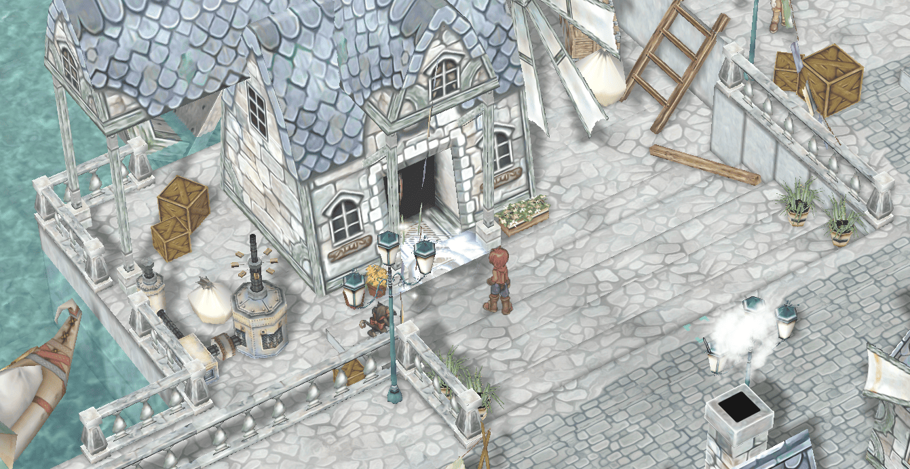 |

* **Thực phẩm Sinh Lực:** +10
* **Sức Mạnh:** 10
* **Tập Trung:** 10
* **Magnificat:** 5
* **Gloria:** 5
* **Thời Gian Buff:** 15 phút (Thường)
* <mark style="color:red;">**Thời Gian Buff:**</mark> <mark style="color:red;"></mark><mark style="color:red;">30 phút (VIP)</mark>

\| !\[Mini-map of Aldebaran - Service Hub] |  |

\| Hugel (INT) | Mô Tả | Bản Đồ Nhỏ || ------------------------------ | ------------------------------------------------------------------------------------------------------------------------------------------------------------------------------------------------------------------------------------------------------------------------------------------------------------------------------------------------------------------------------------------------------------------- | ------------------------------- | | 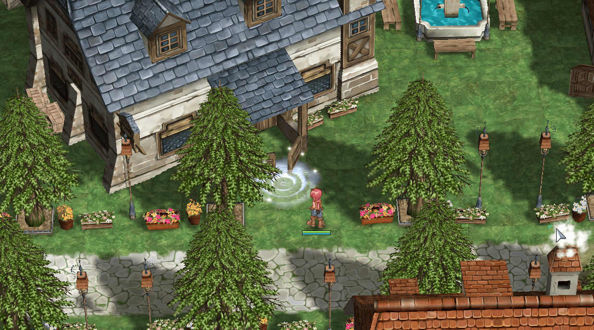 |

* **Thức ăn Trí Tuệ:** +10
* **Sức mạnh:** 10
* **Tập trung:** 10
* **Magnificat:** 5
* **Gloria:** 5
* **Thời gian Buff:** 15 phút (Thường)
* <mark style="color:red;">**Thời gian Buff:**</mark> <mark style="color:red;"></mark><mark style="color:red;">30 phút (VIP)</mark>

\| !\[Mini-map of Hugel - Tourist City] | 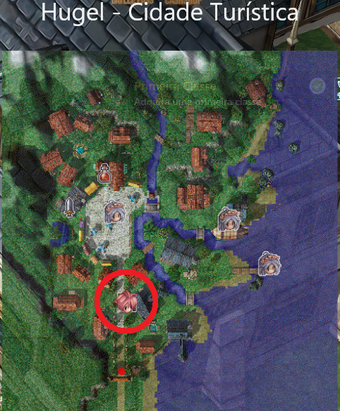 |

<table><thead><tr><th width="248">Louyang (AGI)</th><th>Mô tả</th><th>Bản đồ nhỏ</th></tr></thead><tbody><tr><td></td><td><ul><li><strong>Thức ăn Tăng Agility:</strong> +10</li><li><strong>Sức mạnh:</strong> 10</li><li><strong>Tập trung:</strong> 10</li><li><strong>Magnificat:</strong> 5</li><li><strong>Gloria:</strong> 5</li><li><strong>Thời gian Buff:</strong> 15 phút (Bình thường)</li><li><mark style="color:red;"><strong>Thời gian Buff:</strong> 30 phút (VIP) | ![Bản đồ nhỏ của Louyang - Thành phố có tường]</mark></li></ul></td><td>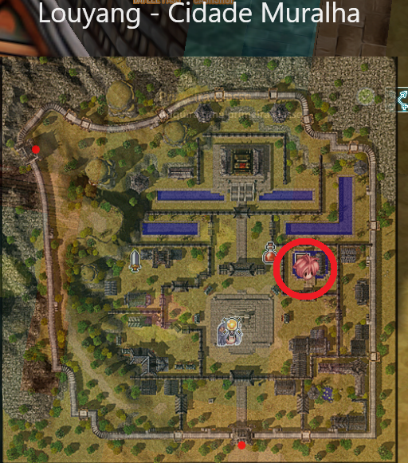</td></tr></tbody></table>

<table><thead><tr><th width="250">Yuno (INT)</th><th>Mô tả</th><th>Bản đồ nhỏ</th></tr></thead><tbody><tr><td>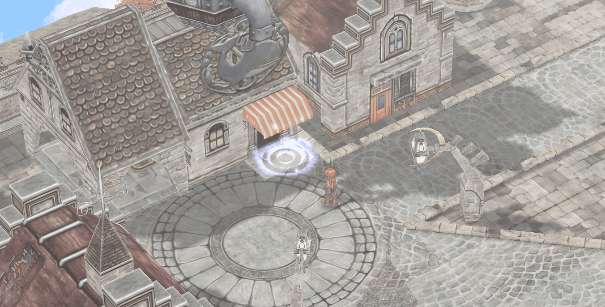</td><td><ul><li><strong>Thức ăn Trí tuệ:</strong> +10</li><li><strong>Sức mạnh:</strong> 10</li><li><strong>Tập trung:</strong> 10</li><li><strong>Magnificat:</strong> 5</li><li><strong>Gloria:</strong> 5</li><li><strong>Thời gian Buff:</strong> 15 phút (Bình thường)</li><li><mark style="color:red;"><strong>Thời gian Buff:</strong> 30 phút (VIP) | ![Bản đồ nhỏ của Yuno - Thành phố Học viện]</mark></li></ul></td><td>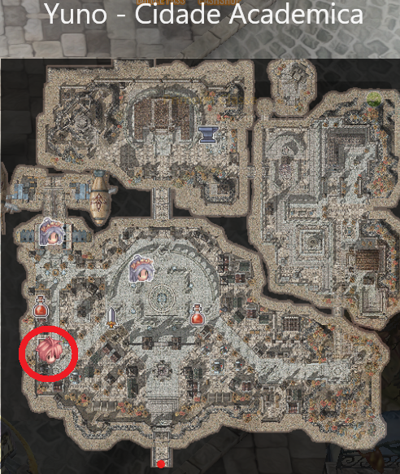</td></tr></tbody></table>
