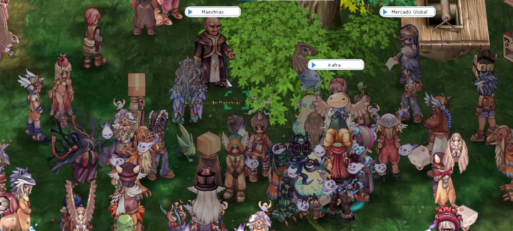
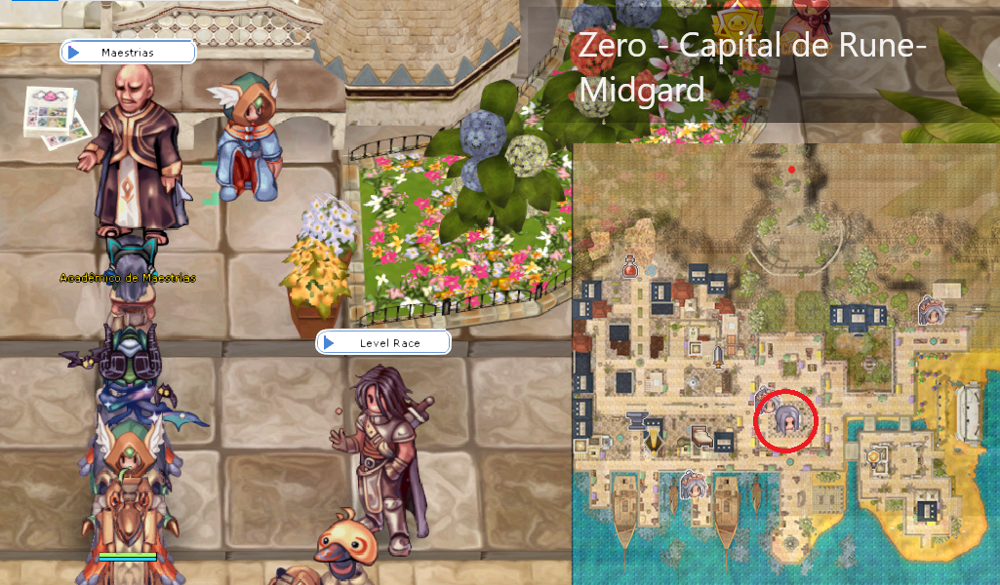
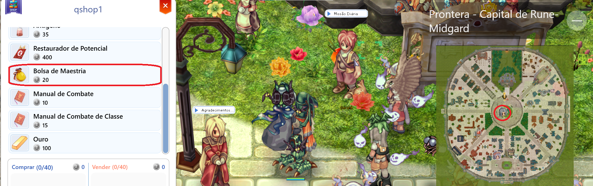
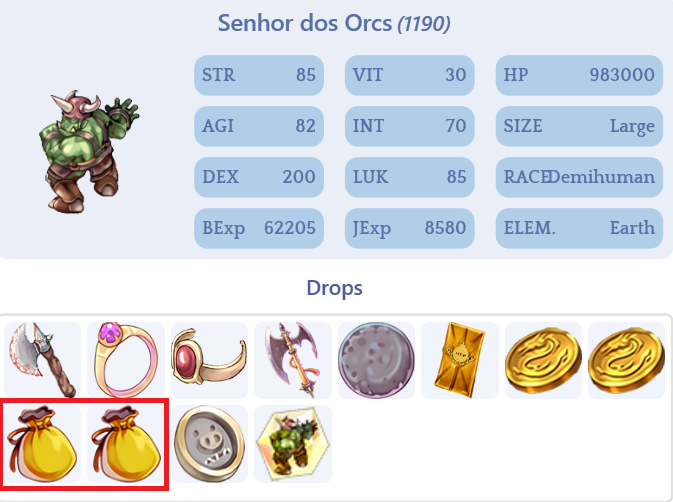
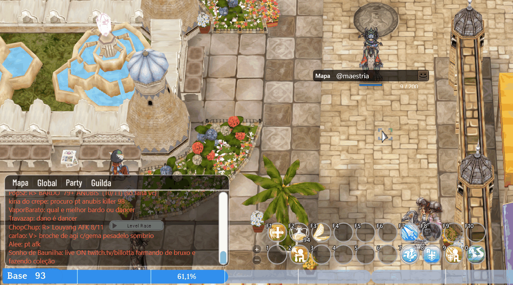
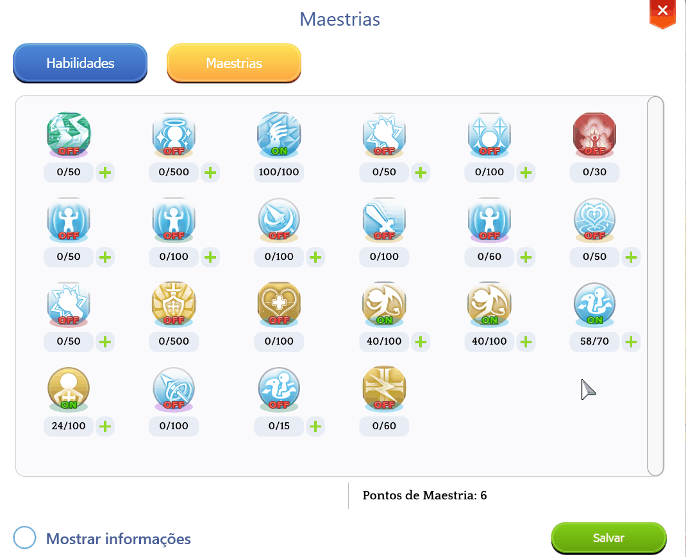

# 🏆 Hệ Thống Thành Thạo

<figure><figcaption>
<mark style="color:red;"><strong>NPC Học Viện Thành Thạo</strong> – Chịu trách nhiệm mua điểm mới.</mark>
</figcaption></figure>

## **Hệ Thống Thành Thạo**

* Trong **Arkaik: Tales of Sarina**, bạn có thể cải thiện hoặc thay đổi hành vi kỹ năng bằng cách phát triển các **thành thạo** của chúng.
* Những thành thạo này có thể được truy cập qua **cửa sổ kỹ năng**<mark style="color:red;">**(ALT + S)**</mark>.
* Bạn có thể bật hoặc tắt các thành thạo bất cứ lúc nào thông qua cửa sổ kỹ năng hoặc bằng cách kéo chúng vào thanh kỹ năng.

***

## **Cách Nhận Điểm Thành Thạo**

**Học Viện Thành Thạo**

* Mua trực tiếp từ NPC **"**<mark style="color:red;">**Học Viện Thành Thạo**</mark>**"**, có mặt ở tất cả các thành phố.* Khi tương tác với NPC, bạn có thể mua **Điểm Thành Thạo**.
* Càng mua nhiều điểm, giá của chúng càng tăng.
* Bạn có thể **"Đặt lại"** bộ đếm thuế với một số lượng **Zeny** nhất định.

<figure><figcaption>
<mark style="color:red;"><strong>Vị trí của Học Viện Thành Thạo tại Thành Phố Zero</strong></mark>
</figcaption></figure>

## **Cửa Hàng Nhiệm Vụ Hàng Ngày**

* Bằng cách hoàn thành <mark style="color:red;">**nhiệm vụ hàng ngày**</mark> trong các thành phố, bạn sẽ kiếm được điểm và có thể đổi chúng lấy **"**<mark style="color:red;">**Túi Thành Thạo**</mark>**"**.
* Bên cạnh NPC, sẽ có một **bức phù điêu**. Chỉ cần nhấp vào **"**<mark style="color:red;">**Phù Điêu**</mark>**"** và chọn một nhiệm vụ.

<figure><figcaption>
<mark style="color:red;"><strong>NPC cho việc đổi nhiệm vụ hàng ngày.</strong></mark>
</figcaption></figure>

### MVPS* Việc đánh bại **MVPs** cũng mang lại cơ hội rơi ra **"**<mark style="color:red;">**Balo Kỹ Năng**</mark>**"**.

<figure><figcaption>
<mark style="color:red;"><strong>Mỗi MVP có cơ hội rơi ra "Balo Kỹ Năng".</strong></mark>
</figcaption></figure>

## **Chỉ Cần Chơi Game**

* <mark style="color:red;">**Mỗi hai giờ**</mark>, bạn **thụ động** nhận **1 điểm kỹ năng miễn phí**.
* Bạn có thể thu thập điểm của mình bằng cách gõ <mark style="color:red;">**@mastery**</mark> trong trò chuyện.
* <mark style="color:red;">**Thời gian không bị đặt lại nếu bạn đăng xuất**</mark>, vì nó là tích lũy.

<figure><figcaption>
<mark style="color:red;"><strong>Sử dụng lệnh @mastery để kiểm tra và nhận điểm của bạn.</strong></mark>
</figcaption></figure>

## **Về Chi Phí Điểm*** **Lần đầu tiên** bạn nói chuyện với NPC bằng bất kỳ nhân vật nào, họ sẽ **cho bạn 7 điểm miễn phí** để giúp bạn hiểu cách hoạt động của hệ thống thành thạo.
* Từ cuộc trò chuyện thứ hai trở đi, bạn có thể <mark style="color:red;">**mua điểm thành thạo**</mark>, nhưng **đối với mỗi điểm đã mua, chi phí Zeny sẽ tăng thêm 25 Zeny**.

### **Ví dụ:**

* Mua **3 điểm thành thạo** sẽ tốn **1,500 Zeny** _(250 + 500 + 750)_.
*   Chi phí mua có thể được tính bằng công thức:

    **(SốLượngThànhThạo \* 250) \* (SốLượngThànhThạo / 1000 / 2) + (SốLượngThànhThạo / 8) \* 1000**
*   **Ví dụ tính toán:** Mua **100 điểm thành thạo** sẽ là:

    **(100 \* 250) \* (100 / 1000 / 2) + (100 / 8) \* 1000 =&#x20;**<mark style="color:green;">**1,262,500 Zeny**</mark>

## **Sử dụng Điểm Thành Thạo**

* Để sử dụng **Điểm Thành Thạo** của bạn, chỉ cần nhấn <mark style="color:red;">**(ALT + S)**</mark> và vào tab **"Thành Thạo"**.* Tất cả **Điểm Thành Thạo** của bạn sẽ được liệt kê bên dưới, và bạn có thể **tiêu chúng một cách tự do**.

<figure><figcaption>
<mark style="color:red;"><strong>Sử dụng Điểm Thành Thạo trong Cây Kỹ Năng.</strong></mark>
</figcaption></figure>