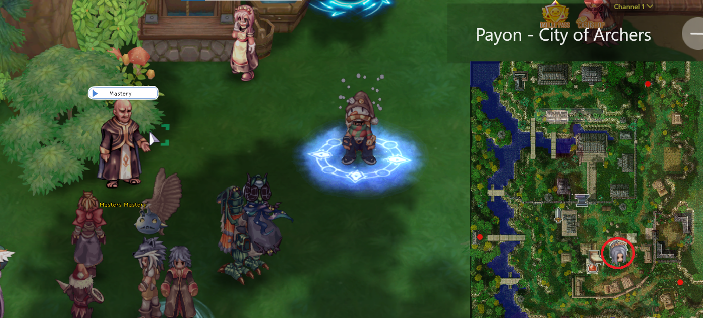
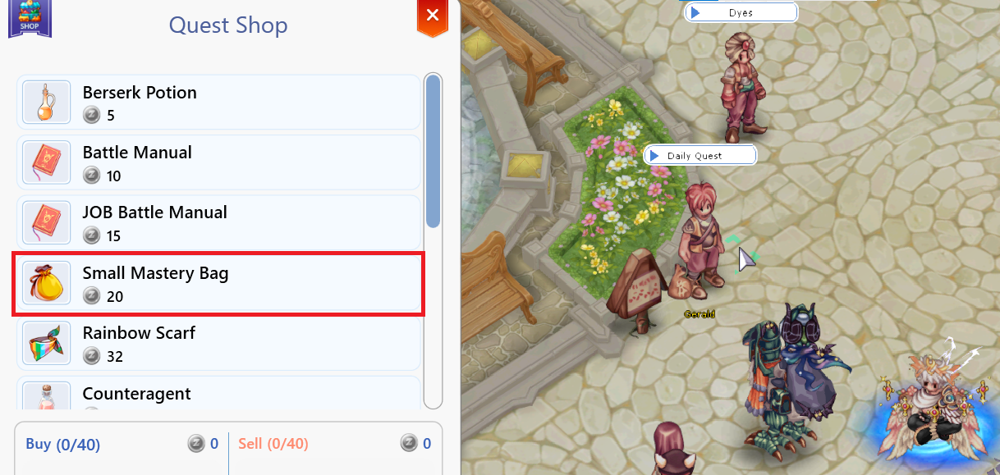
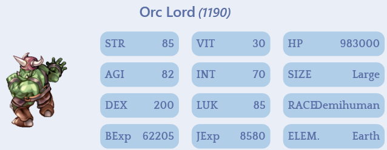
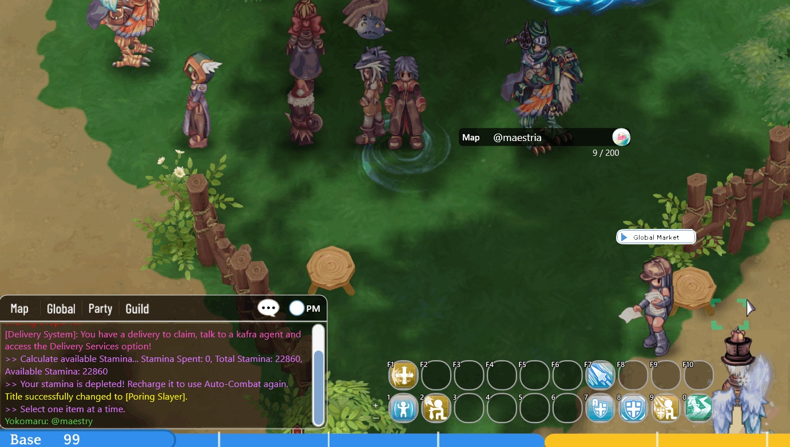
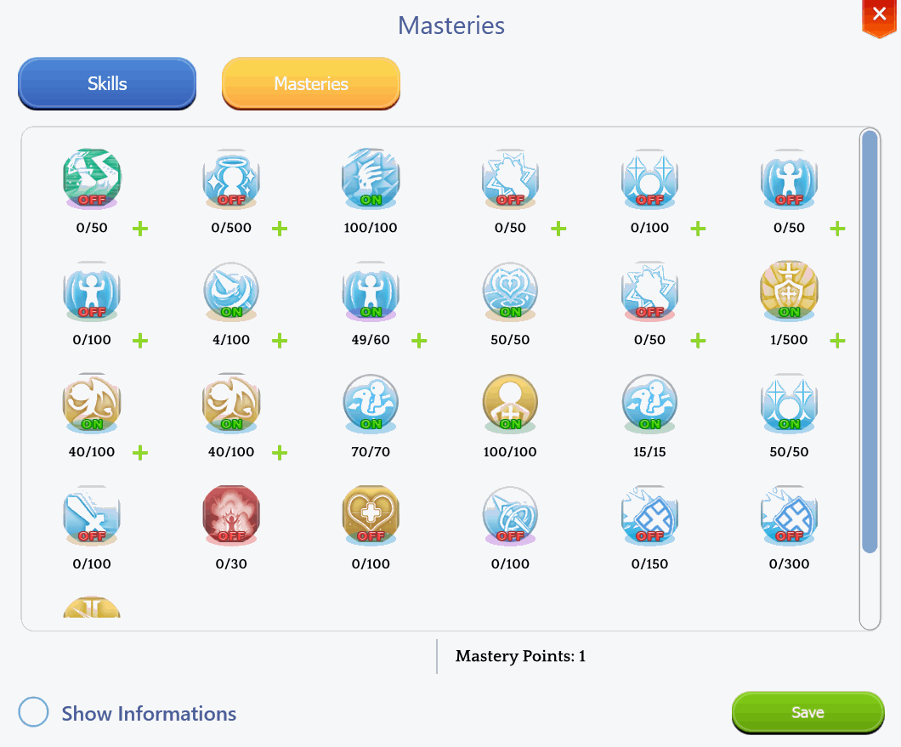

# 🏆 Mastery System

<figure><figcaption>
<mark style="color:red;"><strong>Mastery Academic NPC</strong> – Responsible for purchasing new points.</mark>
</figcaption></figure>

## **Mastery System**

* In **Arkaik: Tales of Sarina**, you can improve or modify skill behavior by evolving their **masteries**.
* These masteries can be accessed through your **skill window&#x20;**<mark style="color:red;">**(ALT + S)**</mark>.
* You can enable or disable masteries at any time via the skill window or by dragging them to the skill bar.

***

## **Obtaining Mastery Points**

**Mastery Academic**

* Purchase directly from the NPC **"**<mark style="color:red;">**Mastery Academic**</mark>**"**, available in all cities.
* When interacting with the NPC, you can buy **Mastery Points**.
* The more points you purchase, the more expensive they become.
* You can **"Reset"** the tax counter for a certain amount of **Zeny**.

<figure><figcaption>
<mark style="color:red;"><strong>Location of the Mastery Academic in Zero City</strong></mark>
</figcaption></figure>

## **Daily Mission Shop**

* By completing <mark style="color:red;">**daily missions**</mark> in cities, you earn points and can exchange them for **"**<mark style="color:red;">**Mastery Bags**</mark>**"**.
* Next to the NPC, there will be a **stone mural**. Simply click on the **"**<mark style="color:red;">**Mural**</mark>**"** and choose a mission.

<figure><figcaption>
<mark style="color:red;"><strong>NPC das Trocas de missões diárias.</strong></mark>
</figcaption></figure>

### MVPS

* Defeating **MVPs** also grants a chance to drop **"**<mark style="color:red;">**Mastery Bags**</mark>**"**.

<figure><figcaption>
<mark style="color:red;"><strong>Each MVP has a chance to drop "Mastery Bags".</strong></mark>
</figcaption></figure>

## **Just by Playing**

* <mark style="color:red;">**Every two hours**</mark>, you **passively** receive **1 mastery point for free**.
* You can collect your points by typing <mark style="color:red;">**@maestria**</mark> in the chat.
* <mark style="color:red;">**The timer does not reset if you log out**</mark>, as it is cumulative.

<figure><figcaption>
<mark style="color:red;"><strong>Using the @maestria command to check if you received your points.</strong></mark>
</figcaption></figure>

## **About Point Cost**

* **The first time** you talk to the NPC with any character, they will **give you 7 free points** to help you understand how the mastery system works.
* From the second conversation onwards, you can <mark style="color:red;">**buy mastery points**</mark>, but **for each point already purchased, the Zeny cost increases by 25 Zeny**.

### **Example:**

* Buying **3 mastery points** would cost **1,500 Zeny** _(250 + 500 + 750)_.
*   The purchase cost can be calculated using the formula:

    **(MasteryAmount \* 250) \* (MasteryAmount / 1000 / 2) + (MasteryAmount / 8) \* 1000**
*   **Example calculation:** Buying **100 mastery points** would be:

    **(100 \* 250) \* (100 / 1000 / 2) + (100 / 8) \* 1000 =&#x20;**<mark style="color:green;">**1,262,500 Zeny**</mark>

## **Using Mastery Points**

* To use your **Mastery Points**, simply press <mark style="color:red;">**(ALT + S)**</mark> and go to the **"Mastery"** tab.
* All your **Mastery Points** will be listed below, and you can **spend them freely**.

<figure><figcaption>
<mark style="color:red;"><strong>Using Mastery Points in the Skill Tree.</strong></mark>
</figcaption></figure>
