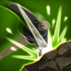
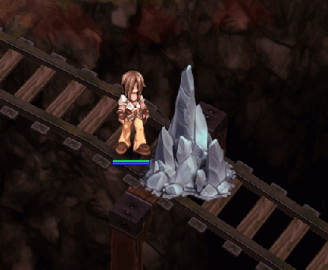
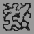
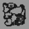

# ⛏️ Sistem Pertambangan

## **Sistem Pertambangan**

* **Sistem pertambangan** di **Arkaik** melibatkan ekstraksi **bijih tertentu** yang dapat **disempurnakan** atau digunakan untuk **membuat peralatan dan item**.
* Pemain harus menggunakan **alat yang sesuai** dan menjelajahi **area yang ditentukan** untuk menemukan berbagai **sumber daya**.
* Ini adalah **sistem terintegrasi** yang mendukung **perdagangan dan pengembangan karakter**, mendorong **penjelajahan dan ekonomi**.

***

## **Tentang Pertambangan**

### **Tambang yang Ada**

* Tambang Mineral
* Tambang Besi
* Tambang Emas
* Tambang Berlian

***

## **Variasi Tambang**

* Setiap tambang **menjatuhkan item tertentu**, memiliki jumlah **HP** yang ditetapkan, dan muncul dalam **jumlah yang berbeda** tergantung pada peta.
* Selain **jatuhan bijih tertentu**, **semua tambang** memiliki **daftar jatuhan item umum** yang dapat diperoleh pada **setiap serangan**.* Setiap item memiliki **tingkat dropnya sendiri**, dan **semua item di-roll secara terpisah** per hit, yang berarti Anda dapat **mendapatkan beberapa item dalam satu hit (jika beruntung).**

***

## **Cara Kerjanya**

* **Setiap hit memiliki 5% kemungkinan** untuk mendapatkan **drop spesifik** dari setiap tambang.
* **Semua item spesifik** dari tambang **memiliki peluang drop yang sama**, tetapi hanya **satu** dari mereka yang dikumpulkan pada satu waktu, yang berarti **satu item dipilih secara acak ketika peluang 5% terpicu**.

***

## **Drop Tambahan**

* Jika pemain memiliki keterampilan **"\[Mining] Tambang Eksplosif"** dan **HP tambang 10 atau lebih rendah**, pengguna akan memiliki **\[10 \* levelKeterampilan]% kemungkinan** untuk mendapatkan **drop tambahan** dari tambang tersebut _(drop dijamin pada level maksimum)_.

## **Waktu Respawn*** **Waktu respawn minimum:** **1 jam**, tetapi ada <mark style="color:red;">**30% kemungkinan**</mark> <mark style="color:red;"></mark><mark style="color:red;">bahwa</mark> <mark style="color:red;"></mark><mark style="color:red;">**bijih tidak akan respawn**</mark> <mark style="color:red;"></mark><mark style="color:red;">dalam jam berikutnya.</mark>

## **Cara Menambang?**

* Untuk menambang, Anda harus terlebih dahulu tergolong dalam kelas **"**<mark style="color:red;">**Blacksmith**</mark>**"**.
* Anda harus memiliki keterampilan **"**<mark style="color:red;">**Mine**</mark>**"** yang terbuka.



<figure><figcaption>
<mark style="color:red;"><strong>Keterampilan: Mine</strong></mark>
</figcaption></figure><table><thead><tr><th width="217">Informasi Skill: "Mine"</th><th>Detail</th></tr></thead><tbody><tr><td>Jenis Penggunaan</td><td>Pribadi</td></tr><tr><td>Level Maksimal</td><td>1</td></tr><tr><td>Fungsi</td><td>Memungkinkan menambang bijih di lapangan.</td></tr><tr><td>Penggunaan Skill</td><td>Periksa level menambang.</td></tr></tbody></table>



<figure><figcaption>
<mark style="color:red;"><strong>Mencari Mineral</strong></mark>
</figcaption></figure>

## **Item yang Dapat Ditambang**<table><thead><tr><th width="88">Item</th><th width="225">Nama Item</th><th>ID</th><th>Tarif Jatuh (%)</th></tr></thead><tbody><tr><td></td><td>Stone Arrow</td><td><em>1756</em></td><td>35%</td></tr><tr><td></td><td>Cursed Emerald</td><td><em>7725</em></td><td>15%</td></tr><tr><td></td><td>Batu</td><td><em>7049</em></td><td>15%</td></tr><tr><td></td><td>Fragmen Batu</td><td><em>6078</em></td><td>8%</td></tr><tr><td></td><td>Emveretarcon</td><td><em>1011</em></td><td>3%</td></tr><tr><td></td><td>Arang</td><td><em>1003</em></td><td>3%</td></tr><tr><td></td><td>Batu Berkilau</td><td><em>640</em></td><td>2%</td></tr><tr><td></td><td>Stell</td><td><em>999</em></td><td>1%</td></tr></tbody></table>


## **Tentang Pertambangan**

### <mark style="color:blue;">**Tambang Mineral**</mark>

<table><thead><tr><th width="183">Informasi	</th><th>Deskripsi</th></tr></thead><tbody><tr><td>Jenis Tambang</td><td>Tambang mineral</td></tr><tr><td>Pengalaman</td><td>1</td></tr><tr><td>HP Mineral</td><td>15 ~ 30</td></tr><tr><td>Kerusakan Diterapkan</td><td>1 ~ 3</td></tr><tr><td>(ID) Jatuhan Lokal</td><td>6077, 1003, 1002, 1010, 7300, 6051</td></tr><tr><td>Bijih</td><td>Mineral MentahBatubaraBijih Besi Batu Permata Mineral Abu-abu</td></tr></tbody></table><table><thead><tr><th width="99">Peta</th><th>Nama Peta</th><th>Kuantitas Bijih</th></tr></thead><tbody><tr><td></td><td>anthell02</td><td>15</td></tr><tr><td></td><td>pay_dun00</td><td>25</td></tr><tr><td></td><td>pay_dun01</td><td>27</td></tr><tr><td></td><td>pay_dun02</td><td>20</td></tr><tr><td></td><td>ein_dun01</td><td>25</td></tr><tr><td></td><td>ein_dun02</td><td>30</td></tr><tr><td></td><td>beach_dun3</td><td>30</td></tr><tr><td></td><td>beach_dun</td><td>35</td></tr><tr><td></td><td>gef_dun01</td><td>15</td></tr><tr><td></td><td>gef_dun02</td><td>10</td></tr><tr><td></td><td>cmd_fild01</td><td>10</td></tr><tr><td></td><td>moc_fild12</td><td>20</td></tr></tbody></table>### <mark style="background-color:purple;">Tambang Besi</mark>

<table><thead><tr><th width="185">Informasi	</th><th>Deskripsi</th></tr></thead><tbody><tr><td>Jenis Tambang</td><td>Tambang Besi</td></tr><tr><td>Pengalaman</td><td>2</td></tr><tr><td>HP Mineral</td><td>50 ~ 75</td></tr><tr><td>Kerusakan Diterapkan</td><td>3 ~ 7</td></tr><tr><td>(ID) Jatuhan Lokal</td><td>7507, 999, 1770, 7075, 2719, 625</td></tr><tr><td>Bijih</td><td>Potongan Besi Padat Stell Panah Besi Puls Besi Besi Berkarat</td></tr></tbody></table><table><thead><tr><th width="115">Peta</th><th>Nama Peta</th><th>Kuantitas Bijih</th></tr></thead><tbody><tr><td></td><td>mjo_dun02</td><td>45</td></tr><tr><td></td><td>beach_dun2</td><td>35</td></tr><tr><td></td><td>mjo_dun03</td><td>35</td></tr><tr><td></td><td>orcsdun01</td><td>4</td></tr></tbody></table>

### <mark style="background-color:yellow;">Tambang Emas</mark><table><thead><tr><th width="186">Informasi	</th><th>Deskripsi</th></tr></thead><tbody><tr><td>Jenis Tambang</td><td>Tambang Emas</td></tr><tr><td>Pengalaman</td><td>4</td></tr><tr><td>HP Mineral</td><td>120 ~ 170</td></tr><tr><td>Kerusakan Diterapkan</td><td>5 ~ 9</td></tr><tr><td>(ID) Jatuhan Lokal</td><td>7725, 984, 732, 2610, 12684, 969, 985</td></tr><tr><td>Bijih</td><td>Emerald Terkutuk Oridecon Cincin Emas Berlian 3-Karat  Ramuan Emas  Emas Elunium</td></tr></tbody></table>

| Peta                                              | Nama Peta   | Jumlah Bijih |
| ------------------------------------------------ | ----------- | ------------ ||        | pay\_dun01 | 2            |
| .png>) | pay\_dun02 | 3            |
|          | einbech    | 10           |
|        | mjo\_dun01 | 8            |
| .png>) | mjo\_dun02 | 7            |
| .png>) | orcsdun01  | 16           |

### <mark style="background-color:green;">Tambang Berlian</mark><table><thead><tr><th width="192">Informasi	</th><th>Deskripsi</th></tr></thead><tbody><tr><td>Jenis Tambang</td><td>Tambang Berlian</td></tr><tr><td>Pengalaman</td><td>7</td></tr><tr><td>HP Mineral</td><td>175 ~ 250</td></tr><tr><td>Kerusakan Diterapkan</td><td>9 ~ 12</td></tr><tr><td>(ID) Drop Lokal</td><td>7725, 985, 733, 730, 731, 969</td></tr><tr><td>Bijih</td><td> Zamrud Terkutuk  Elunium Berlian Retak Berlian 1 Karat Berlian 2 Karat </td></tr></tbody></table>

| Peta                                              | Nama Peta   | Jumlah Bijih |
| ------------------------------------------------ | ----------- | ------------ |
| .png>) | pay\_dun02 | 3            |
|        | anthell01  | 5            || .png>) | anthell02  | 5            |
|        | orcsdun02  | 10           |
|        | moc\_ruins | 12           |