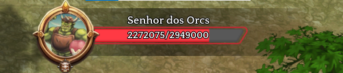
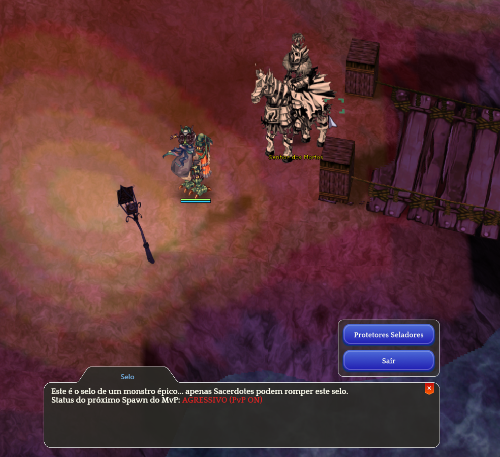

# 💎 MVP Seals

* The <mark style="color:red;">**MVP Seal system**</mark> replaces the traditional <mark style="color:red;">**Tombstone system**</mark> known by many.
* You can find **statues of epic monsters** scattered throughout **Rune-Midgard**, but **only Priests can interact with the resurrection**.
* When a character capable of breaking the seal begins the summoning, they will recite a poem, and at the end of the poem, the <mark style="color:red;">**epic monster will be summoned**</mark>.
* The **epic monster’s HP bar** remains visible to all players nearby, and **the game’s music changes accordingly**.

<figure><figcaption>
<mark style="color:red;"><strong>MVP HP Bar</strong></mark>
</figcaption></figure>

## **How to Find a Sealed MVP?**

* **Sealed MVPs** are scattered across **various maps**.
* As long as the MVPs are **not revived**, they will appear as **petrified statues**.
* To **release them**, simply call a <mark style="color:red;">**Priest**</mark>, who can break the seal and **set them free**.

<figure><figcaption></figcaption></figure>

## **MVP Locations List**

* You can also check the availability of all <mark style="color:red;">**MVPs**</mark> below.

<table><thead><tr><th width="245">Monster</th><th width="126">Level</th><th>Map</th><th>Respawn Time</th></tr></thead><tbody><tr><td>Queen Bee</td><td>74</td><td>mjolnir_04</td><td>120 minutes</td></tr><tr><td>Amon Ra</td><td>88</td><td>moc_pryd06</td><td>80 minutes</td></tr><tr><td>Baphomet</td><td>81</td><td>prt_maze03</td><td>120 minutes</td></tr><tr><td>Golden Thief Bug</td><td>64</td><td>prt_sewb4</td><td>120 minutes</td></tr><tr><td>Doppelganger</td><td>72</td><td>gef_dun02</td><td>120 minutes</td></tr><tr><td>Dracula</td><td>85</td><td>gef_dun01</td><td>80 minutes</td></tr><tr><td>Drake</td><td>70</td><td>treasure02</td><td>120 minutes</td></tr><tr><td>Eddga</td><td>65</td><td>pay_fild10</td><td>120 minutes</td></tr><tr><td>Pharaoh</td><td>93</td><td>in_sphinx5</td><td>70 minutes</td></tr><tr><td>Moonlight Flower</td><td>67</td><td>pay_dun04</td><td>70 minutes</td></tr><tr><td>Freeoni</td><td>69</td><td>moc_fild17</td><td>120 minutes</td></tr><tr><td>Turtle General</td><td>97</td><td>tur_dun04</td><td>70 minutes</td></tr><tr><td>Kraken</td><td>70</td><td>iz_dun04</td><td>140 minutes</td></tr><tr><td>Lady Tanee</td><td>89</td><td>ayo_fild01</td><td>420 minutes</td></tr><tr><td>Maya</td><td>81</td><td>anthell02</td><td>120 minutes</td></tr><tr><td>Orc Hero</td><td>77</td><td>gef_fild03</td><td> 60 minutes</td></tr><tr><td>Osíris</td><td>78</td><td>moc_pryd04</td><td>70 minutes</td></tr><tr><td>Giant Octopus</td><td>90</td><td>jawaii</td><td>240 minutes</td></tr><tr><td>RSX-0806</td><td>86</td><td>ein_dun02</td><td>130 minutes</td></tr><tr><td>Lord of the Dead</td><td>94</td><td>niflheim</td><td>120 minutes</td></tr><tr><td>Orc Lord</td><td>74</td><td>gef_fild10</td><td>120 minutes</td></tr><tr><td>Tao Gunka</td><td>70</td><td>beach_dun</td><td>300 minutes</td></tr></tbody></table>

## **Rankings and Classification**

* When the **MVP** is defeated, you can check the **Ranking** in the **"Sealed Protectors"**.
* It is divided into **"**<mark style="color:red;">**Top Damage**</mark>**"**, **"**<mark style="color:green;">**Top Heal**</mark>**"**, and **"**<mark style="color:blue;">**Top Tank**</mark>**"**.
* Players in the ranking will receive **extra rewards** in addition to the **dropped loot**.



<figure><figcaption>
<mark style="color:red;"><strong>Information about the player who endured the most damage from the MVP in question.</strong></mark>
</figcaption></figure>



<figure><figcaption>
<mark style="color:red;"><strong>Information about the player who healed the most during the fight against the MVP.</strong></mark>
</figcaption></figure>



<figure><figcaption>
<mark style="color:red;"><strong>Information about the player who endured the most damage from the MVP in question.</strong></mark>
</figcaption></figure>


