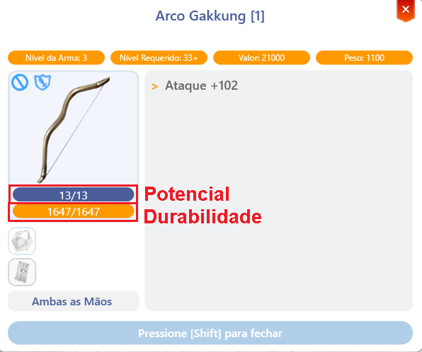

# 💪 Sistem Potensi

## **Tentang Sistem Potensi**

* <mark style="color:red;">**Peralatan sekarang memiliki 2 atribut baru**</mark> yang mungkin terlihat membingungkan pada awalnya, **tapi di sini kami menjelaskan apa yang dilakukan masing-masing.**

<figure><figcaption>
<mark style="color:red;"><strong>Bagaimana mengidentifikasi Potensi dan Daya Tahan</strong></mark>
</figcaption></figure>

## 📍 Cara Mengidentifikasi Potensi dan Daya Tahan

➡ **Serangan +102**

📌 <mark style="color:red;">**Potensi:**</mark> <mark style="color:red;">**13/13**</mark>\
📌 <mark style="color:green;">**Daya Tahan:**</mark> <mark style="color:green;">**1647/1647**</mark>

👐 **Dua Tangan**

🔹 **Tekan \[Shift] untuk menutup**

## **Daya Tahan**

* <mark style="color:red;">**Daya Tahan**</mark> menentukan kapan sebuah item **akan rusak saat mencapai 0**.* **Item yang rusak tidak dapat dipakai**, tetapi jangan khawatir—item yang rusak dapat **diperbaiki dengan mudah** oleh **Artisan Master** di kota-kota.
* Beberapa faktor dapat menyebabkan peralatan kehilangan daya tahan, termasuk:
  * **Mati** mengakibatkan **kerugian daya tahan sebesar 25%** untuk item yang dipakai.
  * **Mengalahkan monster yang lebih tinggi levelnya daripada Anda** memiliki <mark style="color:red;">**1% hingga 3% kemungkinan**</mark> untuk mengurangi daya tahan item.
  * **Keterampilan tertentu** juga dapat mempengaruhi daya tahan.
* <mark style="color:red;">**Peralatan dapat diperbaiki di kota-kota**</mark> <mark style="color:red;"></mark><mark style="color:red;">di mana Anda menemukan</mark> <mark style="color:red;"></mark><mark style="color:red;">**ikon palu di mini-peta**</mark><mark style="color:red;">.</mark>

***

## **Pemula*** <mark style="background-color:green;">**Untuk pemain pemula, kehilangan daya tahan dikurangi setengah**</mark> <mark style="background-color:green;"></mark><mark style="background-color:green;">sementara</mark> <mark style="background-color:green;"></mark><mark style="background-color:green;">**level dasar mereka 60 atau lebih rendah**</mark><mark style="background-color:green;">.</mark>