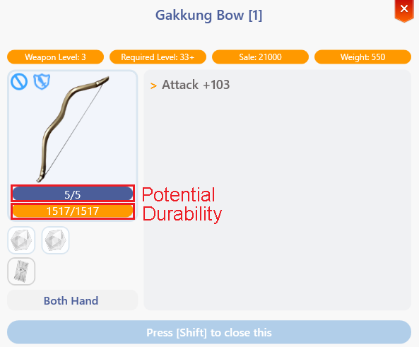

# 💪 Potential System

<figure><figcaption></figcaption></figure>

## **About the Potential System**

* <mark style="color:red;">**Equipment now has 2 new attributes**</mark> that may seem confusing at first, **but here we explain what each one does.**

<figure><figcaption>
<mark style="color:red;"><strong>How to Identify Potential and Durability</strong></mark>
</figcaption></figure>

## 📍 How to Identify Potential and Durability

➡ **Attack +103**

📌 <mark style="color:red;">**Potential:**</mark> <mark style="color:red;"></mark><mark style="color:red;">5</mark><mark style="color:red;">**/5**</mark>\
📌 <mark style="color:green;">**Durability:**</mark> <mark style="color:green;">**1517/1517**</mark>

👐 **Two-Handed**

🔹 **Press \[Shift] to close**

## **Durability**

* <mark style="color:red;">**Durability**</mark> determines when an item **breaks upon reaching 0**.
* **Broken items cannot be equipped**, but don't worry—broken items can be **easily repaired** by any **Artisan Master** in cities.
* Several factors can cause equipment to lose durability, including:
  * **Dying** results in **a 25% durability loss** for equipped items.
  * **Defeating a monster higher level than you** has a <mark style="color:red;">**1% to 3% chance**</mark> to decrease item durability.
  * **Certain skills** may also affect durability.
* <mark style="color:red;">**Equipment can be repaired in cities**</mark> <mark style="color:red;"></mark><mark style="color:red;">where you find an</mark> <mark style="color:red;"></mark><mark style="color:red;">**anvil icon on the mini-map**</mark><mark style="color:red;">.</mark>

***

## **Beginners**

* <mark style="background-color:green;">**For beginner players, durability loss is reduced by half**</mark> <mark style="background-color:green;"></mark><mark style="background-color:green;">while their</mark> <mark style="background-color:green;"></mark><mark style="background-color:green;">**base level is 60 or lower**</mark><mark style="background-color:green;">.</mark>
