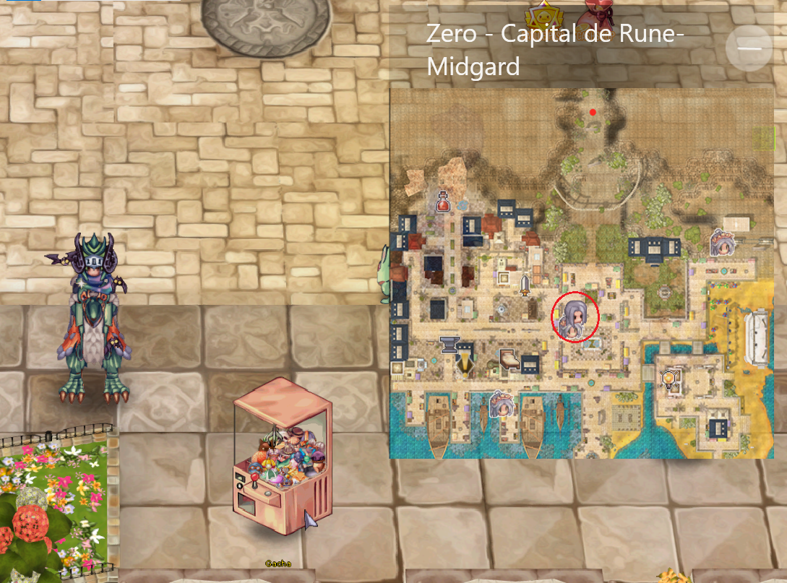

# 🎰 Prize Wheel

## **Về Bánh Xe Giải Thưởng**

* **Cách Chơi:** Người chơi chi <mark style="color:red;">**250k zeny**</mark>**&#x20;cho mỗi lần quay**, nhận được các vật phẩm ngẫu nhiên.
* **Đảm Bảo:** Sau **70 lần quay**, một **vật phẩm hiếm được đảm bảo**; sau **150 lần quay**, một **vật phẩm huyền thoại được đảm bảo**.
* <mark style="color:red;">**Đặt Lại**</mark>**:** Sự đảm bảo cho **vật phẩm hiếm và huyền thoại sẽ được đặt lại sau khi nhận được chúng**.
* **Danh Mục Vật Phẩm:** Các vật phẩm được chia thành **thông thường, không phổ biến, hiếm và huyền thoại**, bao gồm **vật phẩm tiêu hao, phụ kiện và hình ảnh độc đáo**.

***

## **Nơi Tìm Bánh Xe Giải Thưởng?**

* NPC **"**<mark style="color:red;">**Bánh Xe Giải Thưởng**</mark>**"** có thể được tìm thấy ở **tất cả các thành phố**.

<figure><figcaption></figcaption></figure>

## **Danh Sách Các Vật Phẩm Có Thể Nhận Được**

### <mark style="background-color:blue;">**Thông Thường**</mark>| Mục | Số lượng |

\| ---------------------------------------------------------- | -------- | |  Cánh Bay | 40 | |  Cuộn Trắng | 10 | | .png>) Thuốc Trắng Nhỏ | 10 | | .png>) Dâu | 10 | |  Thuốc Giảm Đau | 2 | |  Cuộn Sửa Chữa | 1 |

### <mark style="background-color:purple;">Không phổ biến</mark>

| Mục                                             | Số lượng |
| ----------------------------------------------- | -------- |
|  Lá Yggdrasil    | 2        |
|  Thuốc Chữa Bệnh | 2        |
|  Hạt Yggdrasil   | 2        |
|  Trái Yggdrasil  | 2        |
|  Hộp Oán Hận   | 1        |
|  Hộp Buồn Ngủ  | 1        |
|  Hộp Sấm Sét   | 1        |

### <mark style="background-color:orange;">Hiếm</mark>| Món đồ | Số lượng |

\| -------------------------------------------------------- | -------- | |  Bùa Ziegfried | 10 | | .png>) Thuốc Trắng Nhỏ | 50 | |  Thuốc Điên Cuồng | 5 | | .png>) Cuộn Tăng Tốc | 10 | |  Lô Hội | 2 | |  Oridecon Tinh Chế | 1 | |  Neuralizer | 1 | |  Đá Đổi Mới | 8 | |  Đồng Hoàng Gia | 1 | |  Khăn Bốc Cháy | 1 | |  Aura Điện Tím | 1 | |  Mũ Thợ Mỏ | 1 |

### <mark style="background-color:red;">Huyền Thoại</mark>

| Món đồ                                              | Số lượng |
| --------------------------------------------------- | -------- |
|  Vương Miện Xạ Thủ | 1        |
