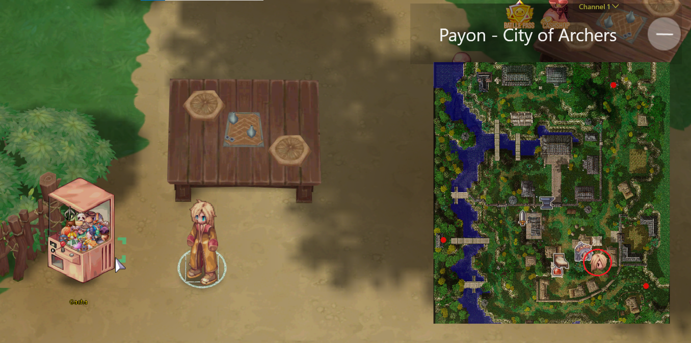
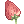
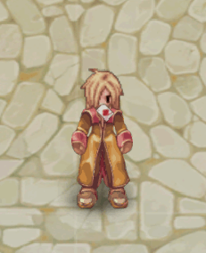
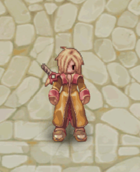
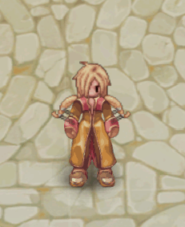
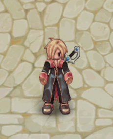
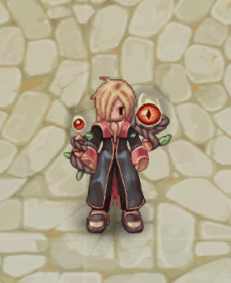

# 🎰 Prize Wheel

<figure><figcaption></figcaption></figure>

## **About the Prize Roulette**

* **Mechanics:** Players spend <mark style="color:red;">**250k zeny**</mark>**&#x20;per spin**, receiving random items.
* **Guarantees:** After **70 spins**, a **rare item is guaranteed**; after **150 spins**, a **legendary item is ensured**.
* <mark style="color:red;">**Reset**</mark>**:** The guarantee for **rare and legendary items resets after obtaining them**.
* **Item Categories:** Items are divided into **common, uncommon, rare, and legendary**, including **consumables, accessories, and unique visuals**.

***

## **Where to Find the Roulette?**

* The **"**<mark style="color:red;">**Prize Roulette**</mark>**" NPC** can be found in **all cities**.

<figure><figcaption>
<mark style="color:red;"><strong>Gacha in Payon City</strong></mark>
</figcaption></figure>

## **List of Obtainable Items**

### <mark style="background-color:blue;">**Common**</mark>

| Item                                                 | Quantity |
| ---------------------------------------------------- | -------- |
|  Fly Wing             | 40       |
|  Blank Scroll        | 10       |
|  Compact White Potion | 10       |
|  Strawberry           | 10       |
|  Anodyne              | 2        |
|  Repair Scroll      | 1        |

### <mark style="background-color:purple;">Uncommon</mark>

| Item                                                 | Quantity |
| ---------------------------------------------------- | -------- |
|  Yggdrasil Leaf       | 2        |
|  Panacea              | 2        |
|  Yggdrasil Seed       | 2        |
|  Yggdrasil Fruit      | 2        |
|  Box of Resentment  | 1        |
|  Box of Drowsiness  | 1        |
|  Box of Thunder     | 1        |

### <mark style="background-color:orange;">Rare</mark>

<table><thead><tr><th width="225.11114501953125">Item</th><th>Quantity</th></tr></thead><tbody><tr><td> Token of Siegfried</td><td>10</td></tr><tr><td> Condensed White Potion</td><td>50</td></tr><tr><td> Berserk Potion</td><td>5</td></tr><tr><td> Scroll to increase Agility</td><td>10</td></tr><tr><td> Aloe Vera</td><td>5</td></tr><tr><td> Enriched Oridecon</td><td>2</td></tr><tr><td> Neuralizer</td><td>1</td></tr><tr><td> Reset Stone</td><td>8</td></tr><tr><td> Coin of the royalty</td><td>8</td></tr><tr><td>Gambler`s Spirit</td><td>1</td></tr><tr><td>Sword of Brave Warrior</td><td>1</td></tr><tr><td>Archer's Essense</td><td>1</td></tr></tbody></table>

### <mark style="background-color:red;">Lengendary</mark>

<table><thead><tr><th width="226.22222900390625">Item</th><th>Quantity</th></tr></thead><tbody><tr><td>

Zero Warrior's Backpack
</td><td>1</td></tr><tr><td>Sinister Observer</td><td>1</td></tr></tbody></table>
