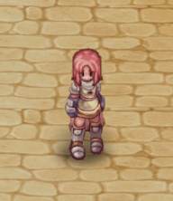
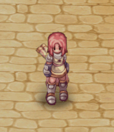
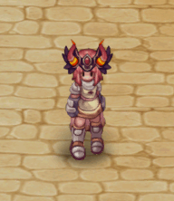
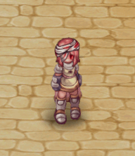
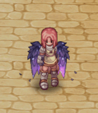
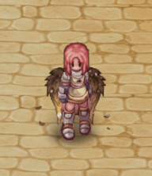
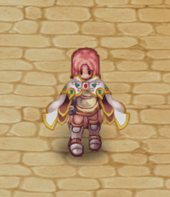
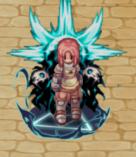

# 🎰 Prize Wheel

<figure><figcaption></figcaption></figure>

## **About the Prize Roulette**

* **Mechanics:** Players spend <mark style="color:red;">30</mark><mark style="color:red;">**0k zeny OR 1K CP**</mark>  **per spin**, receiving random items.
* **Guarantees:** After **70 spins**, a **rare item is guaranteed**; after 10**0 spins**, a **legendary item is ensured**.
* <mark style="color:red;">**Reset**</mark>**:** The guarantee for **rare and legendary items resets after obtaining them**.
* **Item Categories:** Items are divided into **common, uncommon, rare, and legendary**, including **consumables, accessories, and unique visuals**.

***

## **Where to Find the Roulette?**

* The **"**<mark style="color:red;">**Prize Roulette**</mark>**" NPC** can be found in **all cities**.

<figure><figcaption>
<mark style="color:red;"><strong>Gacha in Payon City</strong></mark>
</figcaption></figure>

## **List of Obtainable Items**

### <mark style="background-color:blue;">**Common - 70%**</mark>

| Item                                                 | Quantity |
| ---------------------------------------------------- | -------- |
|  Fly Wing             | 40       |
|  Blank Scroll        | 10       |
|  Compact White Potion | 10       |
|  Strawberry           | 10       |
|  Anodyne              | 2        |
|  Repair Scroll      | 1        |

### <mark style="background-color:purple;">Uncommon - 23%</mark>

| Item                                                                                   | Quantity |
| -------------------------------------------------------------------------------------- | -------- |
| Bubble Gum | 1        |
|  Yggdrasil Seed                                         | 2        |
|  Yggdrasil Fruit                                        | 2        |
|  Box of Resentment                                    | 15       |
|  Box of Drowsiness                                    | 15       |
|  Box of Thunder                                       | 15       |
| Old Gem Album  | 1        |
| .png>)Mysterious Pet Egg                              | 1        |

### <mark style="background-color:orange;">Rare - 6%</mark>

<table><thead><tr><th width="225.11114501953125">Item</th><th>Quantity</th></tr></thead><tbody><tr><td>Divine Potion</td><td>10</td></tr><tr><td>Divine Dumpling</td><td>10</td></tr><tr><td>Token Of Ziegfried</td><td>20</td></tr><tr><td>Small Mastery Bag</td><td>10</td></tr><tr><td>Condensed White Potion</td><td>100</td></tr><tr><td> Enriched Oridecon</td><td>1</td></tr><tr><td> Coin of the royalty</td><td>15</td></tr><tr><td>Infinity Berserk Potion</td><td>1</td></tr><tr><td>
<figure><figcaption></figcaption></figure>

Alchemical Crimson Potion
</td><td>1</td></tr><tr><td>
<figure><figcaption></figcaption></figure>

Ancient Scroll
</td><td>1</td></tr><tr><td>
<figure><figcaption></figcaption></figure>

Enchanted Diabolic Horns
</td><td>1</td></tr><tr><td>
<figure><figcaption></figcaption></figure>

Adventure Bag
</td><td>1</td></tr><tr><td>
<figure><figcaption></figcaption></figure>

Possesed Bandage
</td><td>1</td></tr></tbody></table>

### <mark style="background-color:red;">Lengendary -1%</mark>

<table><thead><tr><th width="226.22222900390625">Item</th><th>Quantity</th></tr></thead><tbody><tr><td>
<figure><figcaption></figcaption></figure>

Potential Restorer
</td><td>2</td></tr><tr><td>
<figure><figcaption></figcaption></figure>

Void Wings
</td><td>1</td></tr><tr><td>
<figure><figcaption></figcaption></figure>

Earth Wings
</td><td>1</td></tr><tr><td>
<figure><figcaption></figcaption></figure>

Stuning Cover
</td><td>1</td></tr><tr><td>
<figure><figcaption></figcaption></figure>

Dark Lord Cloak
</td><td>1</td></tr></tbody></table>
