# 📜 Sistem Relik

<figure>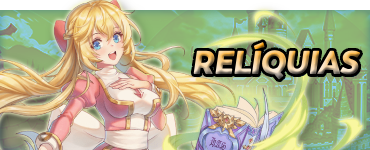<figcaption></figcaption></figure>

## **Perolehan Relik**

* Perjalanan untuk mencari Relik dimulai di **Zero&#x20;**<mark style="color:red;">**Hutan Utara**</mark>, di <mark style="color:red;">**Observatorium**</mark>.
* **(**_**Anda harus LEVEL 90 untuk memulai misi.**_**)**



<figure><figcaption></figcaption></figure>

<table><thead><tr><th width="165">Informasi	</th><th>Deskripsi</th></tr></thead><tbody><tr><td>Observatorium</td><td>Sebelum memulai misi relik, bicaralah dengan <mark style="color:red;"><strong>Lineker</strong></mark> di Observatorium untuk melihat bintang, lalu bicaralah dengannya lagi untuk memulai pencarianmu.</td></tr><tr><td>Gilda</td><td>Setelah berbicara dengan <mark style="color:red;"><strong>Lineker</strong></mark>, kamu akan dikirim ke gilda masing-masing untuk <strong>berbicara dengan pemimpin gilda kelasmu dan melanjutkan</strong>.</td></tr><tr><td>Kerajinan</td><td>Setelah <strong>menyelesaikan misi gilda</strong>, pemain akan <strong>membuka kemampuan untuk membuat Relik mereka</strong>.</td></tr><tr><td>Peningkatan</td><td>Relik dirancang sebagai <mark style="color:red;"><strong>item akhir permainan</strong></mark>, dilengkapi secara visual dengan <strong>Garnet</strong>, dan memberikan <strong>atribut dasar tertentu</strong> untuk setiap kelas.</td></tr></tbody></table>

## **Keuntungan Relik berdasarkan Kelas*** Untuk memeriksa detail <mark style="color:red;">**Relic**</mark>, klik pada **tombol panduan masing-masing** di video di bawah ini.
* Ingat untuk mengalahkan <mark style="color:red;">**Guild Boss**</mark> untuk mengakses item-item tersebut. Anda dapat menyelesaikannya dengan karakter yang berbeda.

<figure><figcaption>
<mark style="color:purple;"><strong>(</strong><strong>Kelas) - (TIER1) - (TIER2)</strong></mark>
</figcaption></figure>



<figure><figcaption>
 <mark style="color:red;"><strong>Ilustrasi Bagaimana Relic Akan Terlihat di Karakter Anda</strong></mark>
</figcaption></figure>



<figure><figcaption></figcaption></figure>



<figure><figcaption></figcaption></figure>


<figure><figcaption>
<mark style="color:red;"><strong>Ilustrasi tentang bagaimana Relik akan terlihat di Karakter Anda</strong></mark>
</figcaption></figure>



<figure>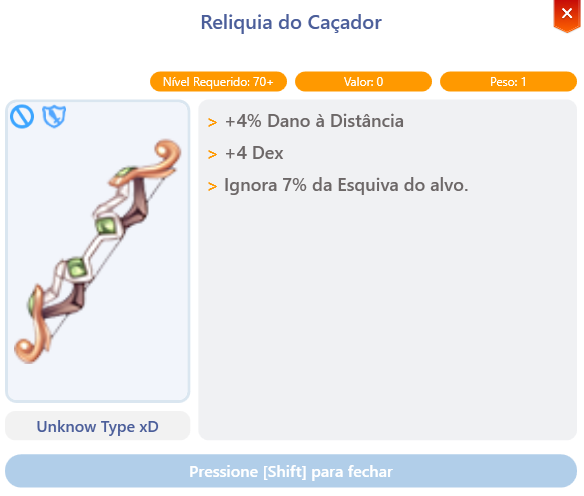<figcaption></figcaption></figure>



<figure><figcaption></figcaption></figure>





<figure><figcaption>
<mark style="color:red;"><strong>Ilustrasi tentang bagaimana Relik akan terlihat di Karakter Anda</strong></mark>
</figcaption></figure>



<figure>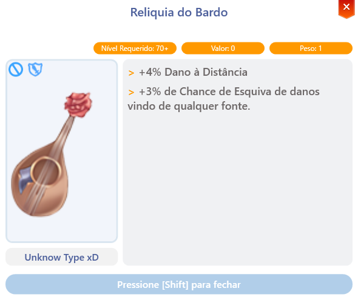<figcaption></figcaption></figure>



<figure><figcaption></figcaption></figure>

<figure><figcaption></figcaption></figure>





<figure><figcaption>
<mark style="color:red;"><strong>Ilustrasi tentang bagaimana Relik akan terlihat di Karakter Anda</strong></mark>
</figcaption></figure>



<figure>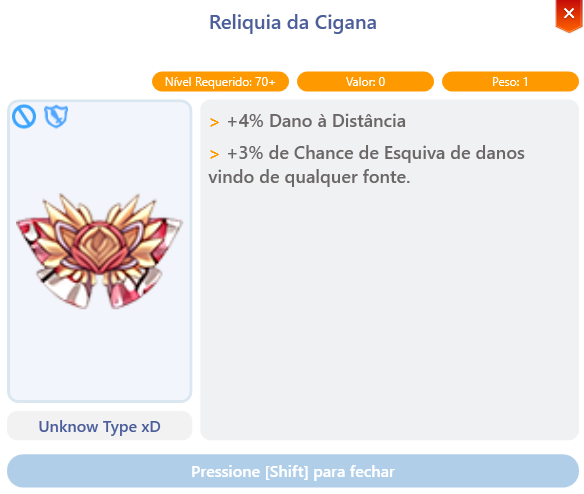<figcaption></figcaption></figure>



<figure>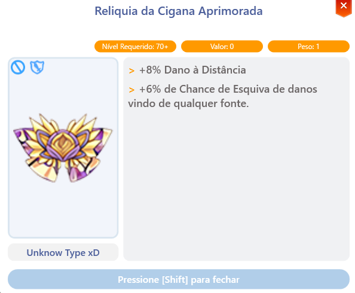<figcaption></figcaption></figure>





<figure><figcaption>
<mark style="color:red;"><strong>Ilustrasi tentang bagaimana Relik akan terlihat di Karakter Anda</strong></mark>
</figcaption></figure>


<figure><figcaption></figcaption></figure>



<figure>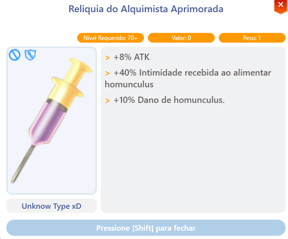<figcaption></figcaption></figure>





<figure><figcaption>
<mark style="color:red;"><strong>Ilustrasi tentang bagaimana Relik akan terlihat di Karakter Anda</strong></mark>
</figcaption></figure>



<figure><figcaption></figcaption></figure>



<figure>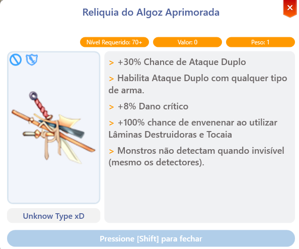<figcaption></figcaption></figure>




<figure><figcaption>
<mark style="color:red;"><strong>Ilustrasi Bagaimana Relik Akan Terlihat di Karakter Anda</strong></mark>
</figcaption></figure>



<figure>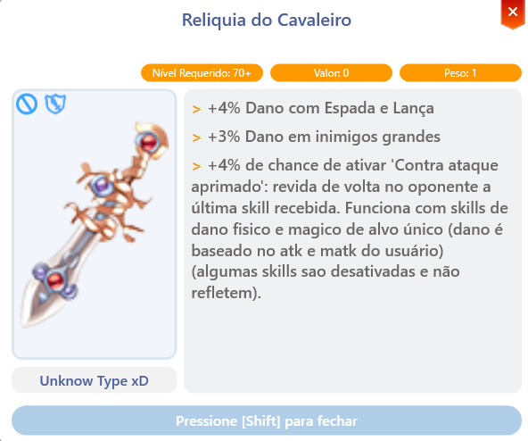<figcaption></figcaption></figure>



<figure><figcaption></figcaption></figure>





<figure><figcaption>
<mark style="color:red;"><strong>Ilustrasi Bagaimana Relik Akan Terlihat di Karakter Anda</strong></mark>
</figcaption></figure>



<figure>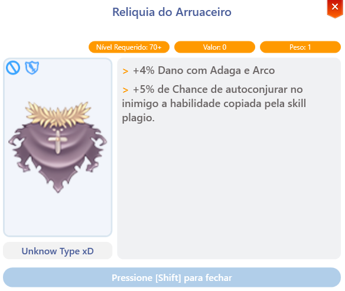<figcaption></figcaption></figure>



<figure><figcaption></figcaption></figure>




<figure><figcaption>
<mark style="color:red;"><strong>Ilustrasi Bagaimana Relik Akan Terlihat di Karakter Anda</strong></mark>
</figcaption></figure>



<figure>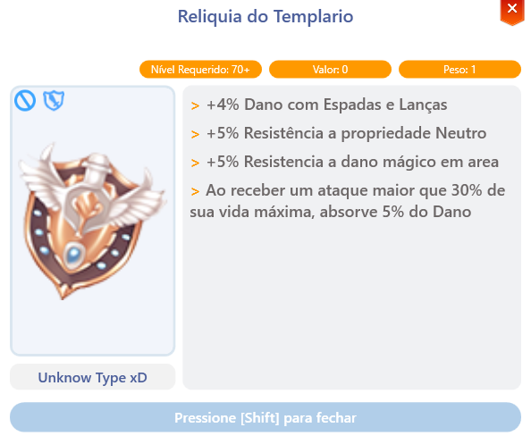<figcaption></figcaption></figure>



<figure>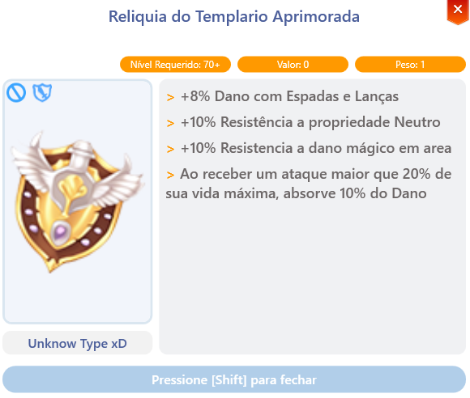<figcaption></figcaption></figure>





<figure><figcaption>
<mark style="color:red;"><strong>Ilustrasi Bagaimana Relik Akan Terlihat di Karakter Anda</strong></mark>
</figcaption></figure>



<figure>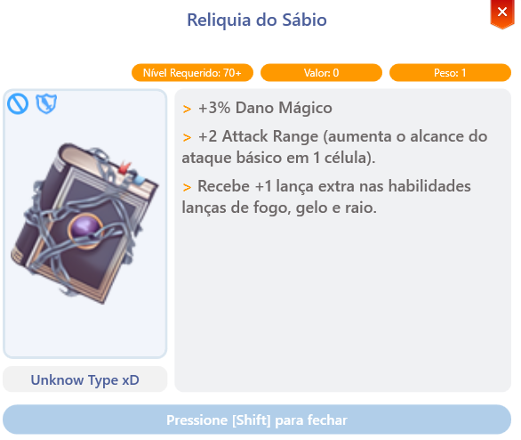<figcaption></figcaption></figure>



<figure>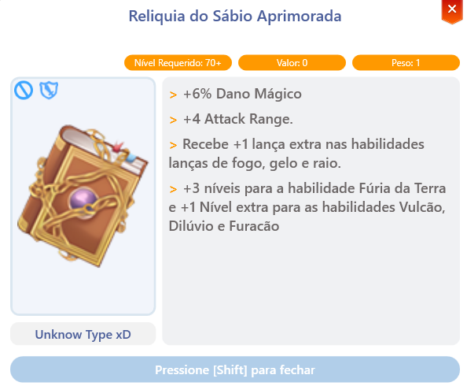<figcaption></figcaption></figure>





<figure><figcaption>
<mark style="color:red;"><strong>Ilustrasi Bagaimana Relik Akan Terlihat di Karakter Anda</strong></mark>
</figcaption></figure>



<figure>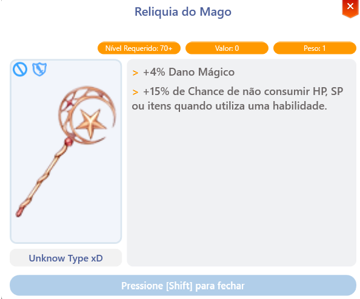<figcaption></figcaption></figure>



<figure>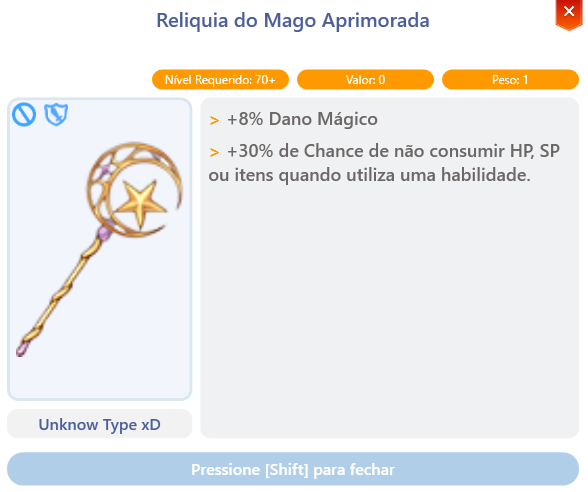<figcaption></figcaption></figure>





<figure><figcaption>
<mark style="color:red;"><strong>Ilustrasi Bagaimana Relik Akan Terlihat di Karakter Anda</strong></mark>
</figcaption></figure>


<figure><figcaption></figcaption></figure>



<figure>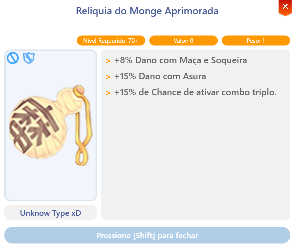<figcaption></figcaption></figure>





<figure><figcaption>
<mark style="color:red;"><strong>Ilustrasi tentang Bagaimana Relik Akan Terlihat di Karakter Anda</strong></mark>
</figcaption></figure>



<figure>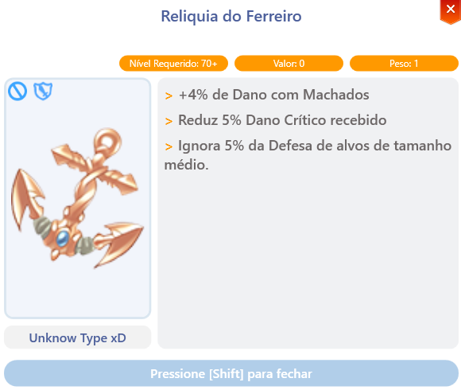<figcaption></figcaption></figure>



<figure><figcaption></figcaption></figure>




<figure><figcaption>
<mark style="color:red;"><strong>Ilustrasi Bagaimana Relik Akan Terlihat di Karakter Anda</strong></mark>
</figcaption></figure>



<figure><figcaption></figcaption></figure>



<figure><figcaption></figcaption></figure>



## **Lokasi NPC untuk Misi Relik**

* Detail lokasi **NPC** untuk setiap kelas untuk memulai **misi Relik**.
* Lokasi-lokasi ini penting agar pemain dapat memulai perjalanan mereka dalam mencari Relik.
* **Setiap NPC** menawarkan <mark style="color:red;">**misi unik untuk setiap kelas**</mark>.

| Kelas                                          | NPC                | Lokasi                |
| ---------------------------------------------- | ------------------ | --------------------- || .png>)**Pendeta** | Suster             | prt\_church (83, 122)  |
| **Pemburu**       | Pemburu Wanita     | hu\_in01 (386, 373)    |
| **Penyanyi**      | Penyanyi Mengembara | payon (161, 178)       |
| **Penari**        | Pencari Bakat      | comodo (189, 163)      |
| **Alkemis**       | Fay                | ein\_in01 (257, 26)    |
| **Pembunuh**      | Lars               | in\_moc\_16 (19, 33)   |
| **Ksatria**       | Saibah             | iz\_ac01 (99, 150)     |
| **Rogue**         | Kel                | in\_rogue (363, 122)   |
| **Krisader**      | Krisader           | prt\_church (115, 122) |
| **Cendekiawan**   | Oberin             | yuno\_in02 (93, 203)   |
| **Penyihir**     | Resepsionis Guild  | gef\_tower (111, 37)   |
| **Biksu**        | Biksu Terakhir     | prt\_monk (246, 79)    |
| **Pandai Besi**  | Claus              | ein\_in01 (22, 151)    || **Taekwon**     | Leonor             | louyang (151, 59)      |