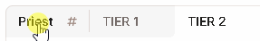
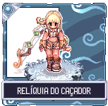
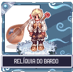
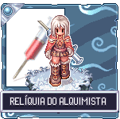
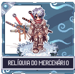
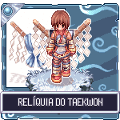
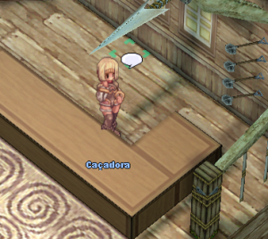
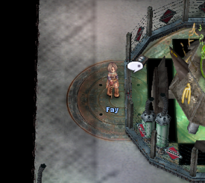
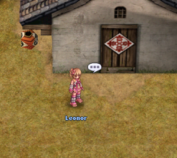

# 📜 Relic System

<figure><figcaption></figcaption></figure>

**Relic Acquisition**

* The journey in search of the Relics begins in the **Zero&#x20;**<mark style="color:red;">**Forest to the North**</mark>, at the <mark style="color:red;">**Observatory**</mark>.
* **(**_**You must be LEVEL 90 to start the quest.**_**)**



<figure><figcaption></figcaption></figure>



<table><thead><tr><th width="165">Information	</th><th>Description</th></tr></thead><tbody><tr><td>Observatory</td><td>Before starting the relic mission, talk to <mark style="color:red;"><strong>Lineker</strong></mark> at the Observatory to see the stars, then speak to him again to start your quest.</td></tr><tr><td>Guild</td><td>After speaking with <mark style="color:red;"><strong>Lineker</strong></mark>, you will be sent to your respective guild to <strong>talk to your class guild leader and proceed</strong>.</td></tr><tr><td>Crafting</td><td>After <strong>completing the guild quest</strong>, players will <strong>unlock the ability to craft their Relic</strong>.</td></tr><tr><td>Enhancement</td><td>Relics are designed as <mark style="color:red;"><strong>late-game items</strong></mark>, visually equipped with <strong>Garnet</strong>, and provide specific <strong>base attributes</strong> for each class.</td></tr></tbody></table>

## **Relic Advantages by Class**

* To check <mark style="color:red;">**Relic**</mark> details, click on the **buttons of each guide** in the video below.
* Remember to defeat the <mark style="color:red;">**Guild Boss**</mark> to access the items. You can complete it on different characters.

<figure><figcaption>
<mark style="color:purple;"><strong>(</strong><strong>Classe) - (TIER1) - (TIER2)</strong></mark>
</figcaption></figure>



<figure><figcaption>
 <mark style="color:red;"><strong>Illustration of How the Relic Will Look on Your Character</strong></mark>
</figcaption></figure>



<figure><figcaption></figcaption></figure>



<figure><figcaption></figcaption></figure>





<figure><figcaption>
<mark style="color:red;"><strong>Illustration of How the Relic Will Look on Your Character</strong></mark>
</figcaption></figure>



<figure><figcaption></figcaption></figure>



<figure><figcaption></figcaption></figure>





<figure><figcaption>
<mark style="color:red;"><strong>Illustration of How the Relic Will Look on Your Character</strong></mark>
</figcaption></figure>



<figure><figcaption></figcaption></figure>



<figure><figcaption></figcaption></figure>





<figure><figcaption>
<mark style="color:red;"><strong>Illustration of How the Relic Will Look on Your Character</strong></mark>
</figcaption></figure>



<figure><figcaption></figcaption></figure>



<figure><figcaption></figcaption></figure>





<figure><figcaption>
<mark style="color:red;"><strong>Illustration of How the Relic Will Look on Your Character</strong></mark>
</figcaption></figure>



<figure><figcaption></figcaption></figure>



<figure><figcaption></figcaption></figure>





<figure><figcaption>
<mark style="color:red;"><strong>Illustration of How the Relic Will Look on Your Character</strong></mark>
</figcaption></figure>



<figure><figcaption></figcaption></figure>



<figure><figcaption></figcaption></figure>





<figure><figcaption>
<mark style="color:red;"><strong>Illustration of How the Relic Will Look on Your Character</strong></mark>
</figcaption></figure>



<figure><figcaption></figcaption></figure>



<figure><figcaption></figcaption></figure>





<figure><figcaption>
<mark style="color:red;"><strong>Illustration of How the Relic Will Look on Your Character</strong></mark>
</figcaption></figure>



<figure><figcaption></figcaption></figure>



<figure><figcaption></figcaption></figure>





<figure><figcaption>
<mark style="color:red;"><strong>Illustration of How the Relic Will Look on Your Character</strong></mark>
</figcaption></figure>



<figure><figcaption></figcaption></figure>



<figure><figcaption></figcaption></figure>





<figure><figcaption>
<mark style="color:red;"><strong>Illustration of How the Relic Will Look on Your Character</strong></mark>
</figcaption></figure>



<figure><figcaption></figcaption></figure>



<figure><figcaption></figcaption></figure>





<figure><figcaption>
<mark style="color:red;"><strong>Illustration of How the Relic Will Look on Your Character</strong></mark>
</figcaption></figure>



<figure><figcaption></figcaption></figure>



<figure><figcaption></figcaption></figure>





<figure><figcaption>
<mark style="color:red;"><strong>Illustration of How the Relic Will Look on Your Character</strong></mark>
</figcaption></figure>



<figure><figcaption></figcaption></figure>



<figure><figcaption></figcaption></figure>





<figure><figcaption>
<mark style="color:red;"><strong>Illustration of How the Relic Will Look on Your Character</strong></mark>
</figcaption></figure>



<figure><figcaption></figcaption></figure>



<figure><figcaption></figcaption></figure>





<figure><figcaption>
<mark style="color:red;"><strong>Illustration of How the Relic Will Look on Your Character</strong></mark>
</figcaption></figure>



<figure><figcaption></figcaption></figure>



<figure><figcaption></figcaption></figure>



## **Location of NPCs for the Relic Quests**

* Details of the **NPCs** locations for each class to start the **Relic quest**.
* These locations are important so that players can begin their journeys in search of Relics.
* **Each NPC** offers a <mark style="color:red;">**unique quest for each class**</mark>.

| Class                                         | NPC                | Location               |
| --------------------------------------------- | ------------------ | ---------------------- |
| **Priest**      | Sister             | prt\_church (83, 122)  |
| **Hunter**      | Huntress           | hu\_in01 (386, 373)    |
| **Bard**        | Wandering Bard     | payon (161, 178)       |
| **Dancer**      | Talent Seeker      | comodo (189, 163)      |
| **Alchemist**   | Fay                | ein\_in01 (257, 26)    |
| **Assasin**     | Lars               | in\_moc\_16 (19, 33)   |
| **Knight**      | Saibah             | iz\_ac01 (99, 150)     |
| **Rogue**       | Kel                | in\_rogue (363, 122)   |
| **Crusader**   | Crusader           | prt\_church (115, 122) |
| **Sage**       | Oberin             | yuno\_in02 (93, 203)   |
| **Wizard**     | Guild Receptionist | gef\_tower (111, 37)   |
| **Monk**       | Last Monk          | prt\_monk (246, 79)    |
| **Blacksmith** | Claus              | ein\_in01 (22, 151)    |
| **Taekwon**    | Leonor             | louyang (151, 59)      |
