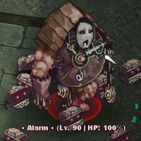
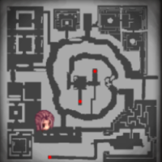
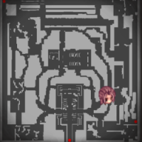
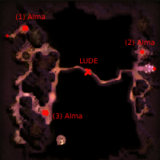

# 👾 Quái Vật Đặc Biệt

<figure><figcaption></figcaption></figure>

## **Sự Khác Biệt Giữa Quái Vật Champion và Quái Vật Đặc Biệt**

* <mark style="color:red;">**10 lần kinh nghiệm**</mark> <mark style="color:red;">và</mark> <mark style="color:red;">**tỷ lệ rơi đồ cao gấp 3 lần**</mark>, quái vật đặc biệt cũng <mark style="background-color:red;">**rơi các vật phẩm độc nhất**</mark> <mark style="background-color:red;">được sử dụng trong</mark> <mark style="background-color:red;">**chế tạo trang bị mạnh mẽ**</mark> _(ví dụ: Ngục Tối Prontera)_.

***

## **Kho Báu Hiếm**

* Ngoài Quái vật độc đáo, những người phiêu lưu trong Arkaik có thể thu thập kho báu hiếm ở nhiều khu vực khác nhau trong trò chơi.
* <mark style="color:red;">**Số lượng vật phẩm rơi ra được gấp ba lần**</mark><mark style="color:red;">,</mark> <mark style="color:red;">**trừ thẻ và đá quý**</mark><mark style="color:red;">.</mark>
* Thêm vào đó, <mark style="color:red;">**một số vật phẩm độc quyền nhất định được cung cấp cho hệ thống chế tạo trang bị**</mark>, tạo thêm một lớp phức tạp cho trò chơi.

***

## **Quái Vật Đặc Biệt và Vật Phẩm Độc Đáo**

### **Đồng Hồ Báo Đặc Biệt**



<figure><figcaption>
<mark style="color:red;"><strong>Đồng Hồ Báo Đặc Biệt</strong></mark>
</figcaption></figure>

* **Lớn hơn bình thường**.
* Chỉ huy một **đội quân Mimic**.
* **Rơi "**<mark style="color:red;">**Đá Ký Ức**</mark>**"** khi bị đánh bại.



<figure><figcaption>
<mark style="color:red;"><strong>Tháp Đồng Hồ - c_tower1</strong> tại <strong>Aldebaran</strong>.</mark>
</figcaption></figure>

* Nằm trong **Tháp Đồng Hồ - c\_tower1** tại **Aldebaran**.
* Xuất hiện hàng ngày từ **21:00 đến 21:30** tại <mark style="color:red;">**Tháp Đồng Hồ của Arkaik**</mark>.
* **Cảnh báo** có thể xuất hiện ở bất kỳ đâu trên bản đồ và sẽ tích lũy nếu không bị đánh bại.



<table><thead><tr><th width="155">Vật phẩm</th><th>Thông tin</th></tr></thead><tbody><tr><td><strong>Ngọc Nhớ</strong></td><td>Vật phẩm dùng để chế tạo trang bị tại NPC CRAFTS trong [<a href="../instances/prontera-dungeon.md">Ngục Tối Prontera</a>]</td></tr></tbody></table>



### **Baphomet Jr. Đặc Biệt**



<figure><figcaption>
<mark style="color:red;"><strong>Baphomet Jr. Đặc Biệt</strong></mark>
</figcaption></figure>

* **Lớn hơn bình thường**.
* Chỉ huy một **đội quân Ridewords**.
* **Rơi "**<mark style="color:red;">**Cánh Đen**</mark>**"** khi bị đánh bại.



<figure><figcaption>
<mark style="color:red;"><strong>Tu Viện Glast Heim - gl_church</strong>.</mark>
</figcaption></figure>

* Nằm ở **Tu Viện Glast Heim - gl\_church**.
* Xuất hiện hàng ngày vào lúc **21:00** tại <mark style="color:red;">**nhà thờ Glast Heim**</mark>.
* Sự kiện kết thúc vào lúc **21:30**, nhưng nếu không bị đánh bại, nó sẽ vẫn ở lại trên bản đồ.
* **Baphomet Jr.** có thể xuất hiện ở nhiều vị trí khác nhau trên bản đồ và tích lũy nếu không bị tiêu diệt.



<table><thead><tr><th width="149">Món đồ</th><th>Thông tin</th></tr></thead><tbody><tr><td><strong>Cánh Đen</strong></td><td>Món đồ được sử dụng để chế tạo trang bị tại NPC CRAFTS trong [<a href="../instances/prontera-dungeon.md">Ngục Tối Prontera</a>]</td></tr></tbody></table>



### **Lude Đặc Biệt**



<figure><figcaption>
<mark style="color:red;"><strong>Lude Đặc Biệt</strong></mark>
</figcaption></figure>

* **Lớn hơn bình thường**.
* Chỉ huy một **đội quân Dullahan**.
* **Rơi "**<mark style="color:red;">**Đầu Xương Cổ Xưa**</mark>**"** khi bị đánh bại.



<figure><figcaption>
<mark style="color:red;">Niflheim - Thung Lũng Gyoll</mark>
</figcaption></figure>

* Nằm ở **Niflheim**.\* Tại **Vale de Gyoll**, những nhà thám hiểm có thể tìm thấy <mark style="color:red;">**ba Linh Hồn Bất An**</mark> ở các tọa độ cụ thể:
  * **(68,328)**
  * **(120,116)**
  * **(344,268)**
* **Giải phóng những linh hồn này là rất quan trọng**, vì nó kích hoạt sự xuất hiện của <mark style="color:red;">**hai Lude Đặc Biệt**</mark> ở trung tâm bản đồ.
* Sau khi giải phóng **ba linh hồn**, **hai Lude Đặc Biệt** sẽ xuất hiện ở giữa bản đồ.



<table><thead><tr><th width="158">Món Đồ</th><th>Thông Tin</th></tr></thead><tbody><tr><td><strong>Hộp sọ Cổ Xưa</strong></td><td>Món đồ được sử dụng để chế tạo trang bị tại NPC CRAFTS trong [<a href="../instances/prontera-dungeon.md">Ngục Tối Prontera</a>]</td></tr></tbody></table>



### **Deniro Đặc Biệt**



<figure><figcaption>
<mark style="color:red;"><strong>Deniro Đặc Biệt</strong></mark>
</figcaption></figure>

* **Lớn hơn bình thường**.
* Chỉ huy một **đội quân Andre**.
* **Rơi "**<mark style="color:red;">**Agate Bùng Cháy**</mark>**"** khi bị đánh bại.



<figure><figcaption>
<mark style="color:red;"><strong>Anthell (Đồi Kiến Địa Ngục)</strong>.</mark>
</figcaption></figure>

* Có mặt tại <mark style="color:red;">**Anthell (Đồi Kiến Địa Ngục)**</mark>.
* Có **điểm xuất hiện cố định** tại tọa độ **(93,251) và (49,181)**.
* **Tái xuất mỗi 30 phút**.
* Bên trong **Đồi Kiến Địa Ngục**, tại **các điểm "4" và "8" trên bản đồ nhỏ**,\
  có **điểm xuất hiện trứng cố định**.
* **Phá hủy những quả trứng này** sẽ **giải phóng Deniro Đặc Biệt**.



<table><thead><tr><th width="182">Món đồ</th><th>Thông tin</th></tr></thead><tbody><tr><td><strong>Đá Ngọc Lửa</strong></td><td>Món đồ được sử dụng để chế tạo trang bị tại NPC CRAFTS trong [<a href="../instances/prontera-dungeon.md">Ngục Tối Prontera</a>]</td></tr></tbody></table>


