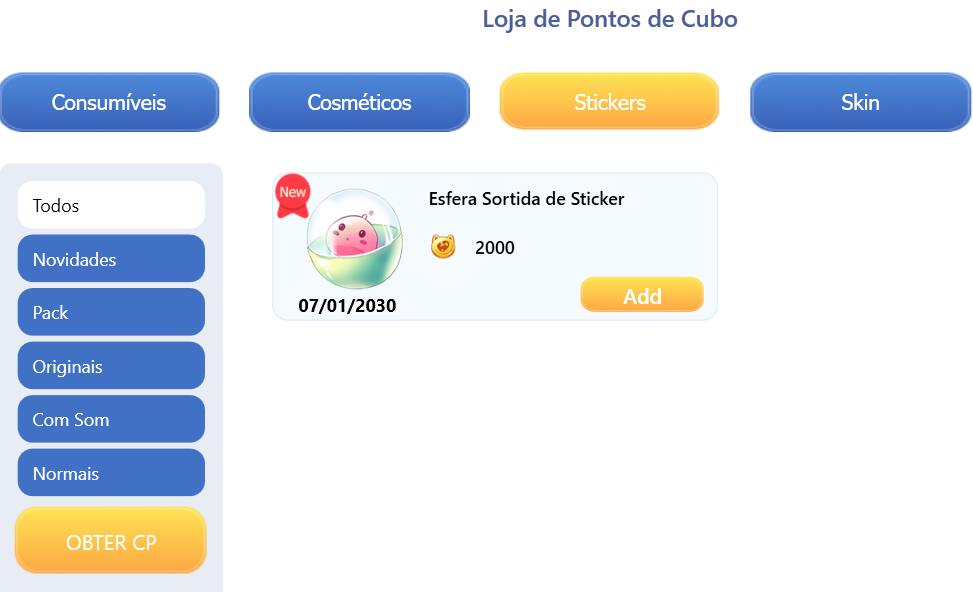
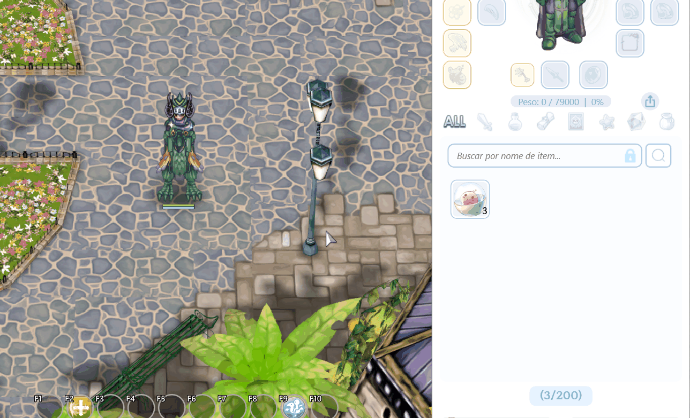

# 🎨 NHÃN DÁN

* **Nhãn dán** có thể được nhận từ <mark style="color:red;">**Cửa Hàng Điểm Cube**</mark>.
* Mỗi tháng, **ba nhãn dán** có sẵn trong cửa hàng sẽ thay đổi. Tuy nhiên, nếu bạn không kiên nhẫn và thích thử vận may, bạn có thể mua một <mark style="color:red;">**Hình Cầu Nhãn Dán Ngẫu Nhiên**</mark> <mark style="color:red;"></mark><mark style="color:red;">với giá</mark> <mark style="color:red;"></mark><mark style="color:red;">**2500 CP**</mark>.

<figure><figcaption>
<mark style="color:red;"><strong>Nhãn dán trong Cửa Hàng Cube</strong></mark>
</figcaption></figure>

## **Cách Sử Dụng Nhãn Dán?**

* Sau khi mua **"Hình Cầu Nhãn Dán Ngẫu Nhiên"**, chỉ cần mở nó ra để nhận một **nhãn dán ngẫu nhiên**.<figure><figcaption>
<mark style="color:red;"><strong>Sử dụng Khối Dán Ngẫu Nhiên để nhận một biểu tượng ngẫu nhiên.</strong></mark>
</figcaption></figure>

## **Cách Sử Dụng Nhãn Dán?**

* Để sử dụng một **nhãn dán**, chỉ cần nhấn phím **"**<mark style="color:red;">**ENTER**</mark>**"** trên bàn phím của bạn như thường lệ, và một **nút nhãn dán** sẽ xuất hiện bên cạnh khung chat.
* Nhấp vào nút sẽ hiển thị **danh sách nhãn dán** mà bạn sở hữu.
* Chọn **nhãn dán** mà bạn muốn, và nó sẽ xuất hiện trong **khung chat và trên đầu nhân vật của bạn**.

<figure><figcaption>
<mark style="color:red;"><strong>Nhãn dán đang được sử dụng.</strong></mark>
</figcaption></figure>